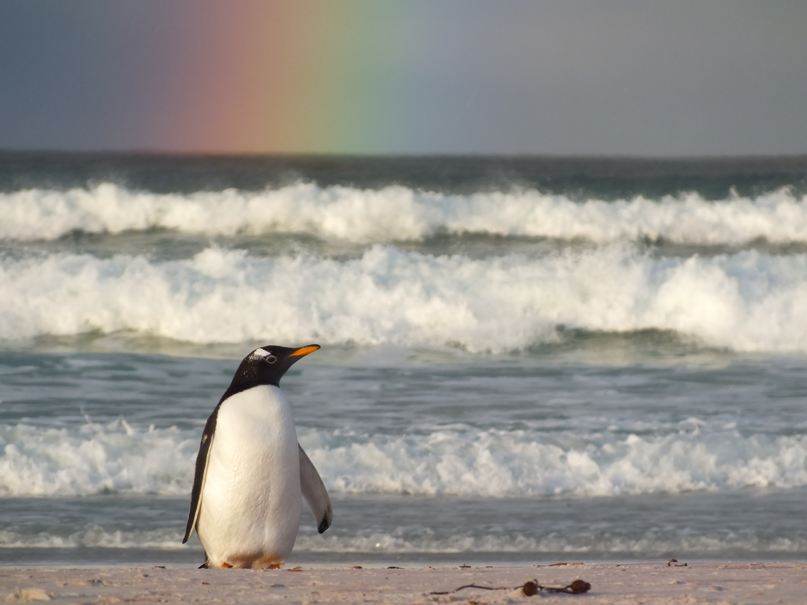

<!-- This is an HTML comment - it will not display when you build the book -->
<!-- Remember, inside this RMarkdown document, text that is not written in code chunks is written in html language -->
<!-- If you need PDF output, uncomment bookdown::pdf_book above in YAML. You will need a LaTeX installation, e.g., https://yihui.name/tinytex/ -->

<!-- Depending on the default setting in the YAML header of RMarkdown doc,
you can remove numbering from headers by adding {-} at the end of a header-->
# Preface {-}


<!--  -->
 


<!-- Adding <br> will give a single line break -->
<br>


<!--chapter:end:index.Rmd-->

# Tracking data: Introduction

<!--- This is an HTML comment in RMarkdown. You can use these comments to make notes that won't get read when running the code -->

<!--- If you don't understand what a RMarkdown document is. Stop here. Go learn. -->

<!--- Equally. You must understand the difference between Markdown vs. RMarkdown -->

<!--- Remember, outside of the R code chunks we are now coding in HTML syntax, not R syntax -->

This chapter was built with **`r sessionInfo()$R.version$version.string`**\

The chapter was last updated on **`r Sys.Date()`** <br>

<!--- In the code chunk below, we specify include = F, so that we will run the chunk but not include the chunk in the final document. We set a global argument in the code chunk of echo = T, so that in later code chunks, the code will be displayed in the RMarkdown document -->

```{r track-intro-setup, include=FALSE}
knitr::opts_chunk$set(echo = TRUE, message = FALSE, warning = FALSE)
## we also specify in the options here to set the overall working directory
## back to the root directory of the R Project we are working in. We do this
## because by default , the working directory for R code chunks is the directory 
## that contains the Rmd document. We don't want this option given our file
## set up prefers the option of having the working directory specified as that
## where the R Project is.
knitr::opts_knit$set(root.dir = "..")
```

## Introduction to animal tracking data considered in this toolkit

This toolkit focuses on the analysis of data primarily from GPS and PTT devices. Some of the analyses may be extended to data from GLS devices. For all devices, we encourage users to understand the limitations of each device and how these limitations can affect interpretation of animal movement patterns.

For a general introduction into understanding **animal movement patterns**, we refer users to:

- **animal movement references TBC**

For a general introduction into understanding **seabird movement patterns**, we refer users to:

- **seabird movement references TBC**

For a general introduction into understanding **GPS, PTT and GLS technologies**, we refer users to:

- **GPS, PTT, GLS references TBC**

## Lay introduction to GPS, PTT, GLS devices

[Consider from MIRO board: Figure: Location data associated with different device types: GPS | PTT | GLS. Showcasing error associated with devices.

Also: consider general text about accuracy of each device and pros and cons of using different devices.]

<!--chapter:end:01-TrackingData-Introduction.Rmd-->

# Tracking data: Sampling strategy

This chapter was built with **`r sessionInfo()$R.version$version.string`**\

The chapter was last updated on **`r Sys.Date()`** <br>

<!--- In the code chunk below, we specify include = F, so that we will run the chunk but not include the chunk in the final document. We set a global argument in the code chunk of echo = T, so that in later code chunks, the code will be displayed in the RMarkdown document -->

```{r track-sample-setup, include=FALSE}
knitr::opts_chunk$set(echo = TRUE, message = FALSE, warning = FALSE)
## we also specify in the options here to set the overall working directory
## back to the root directory of the R Project we are working in. We do this
## because by default , the working directory for R code chunks is the directory 
## that contains the Rmd document. We don't want this option given our file
## set up prefers the option of having the working directory specified as that
## where the R Project is.
knitr::opts_knit$set(root.dir = "..")
```

## Sampling strategy when collecting animal tracking data for seabirds

Animal tracking technology has evolved with respect to size and cost of devices. Hence, the opportunities for collecting tracking data have changed too.

In the past - when devices were much larger and much more expensive - it was likely that few birds were tracked. Tracking typically occurred from sites that were more accessible than others, as opposed to sites specifically being chosen for their larger source populations.

While this type of sampling strategy (selecting sites for accessibility) is often dictated by pragmatic choices needing to be made, or alternate research questions being addressed, outputs from these studies may not necessarily lend themselves well to the identification of globally important sites such as IBAs and KBAs.

Researchers must take sampling strategy into account when considering the type of question they wish to answer in their studies.

Of course, data collected from one study may be used in a different study in future. But the utility of such data being considered for retrospective analyses should be considered appropriately.

## How many birds should you track?

There is no precise answer to this question. The answer in part depends on what kind of question you are trying to answer about a particular species.

If you are tracking a globally threatened species with an extremely small population size, or are tracking a species highly sensitive to devices being deployed on it, then a small number of individuals being tracked may be sufficient to identify where an important site might be.

> However, we suggest that at least 10 birds from a unique dataGroup are tracked before inferring movement patterns about a particular source population.

<!--- using <br> to add a space below the block quotes text before this dataGroup text. -->

<br> **dataGroup**: learn more about how to define a dataGroup in the dataGroup chapter.

## How many years of tracking data should you collect?

Again, there is no precise answer to this question.

Recent evidence, based on GPS tracking of 23 chick-rearing seabird species, suggests that:

-   tracking chick-rearing seabirds across years improves the estimation of at-sea spatial distributions. However, in most cases the information gain is marginal.
-   samples collected in only one or two years can be useful for the identification of important sites.
-   of key importance when considering tracking data for questions related to area-based conservation is whether the sample of tracked individuals is representative at the population level.
-   when only one or two years of tracking data are available for important site identification, using independent evidence to assess whether conditions were typical of the region and time of year is critical for interpretation of results.
-   if conditions were atypical, then further years of sampling may be warranted.

> One to two years of tracking data may be sufficient to inform area-based conservation decisions. However, long-term studies will still be critical to inform how seabirds may respond to envrionmental perturbation.

## How many years of tracking data should you collect for IBA or KBA identification?

[See: KBA Guidelines. Discuss appropriate text with Charlotte]

## Which locations should you track animals from?

A number of factors may dictate which locations you track animals from. Broadly speaking, these factors may include:

-   sites selected depending on the research question you wish to address
-   sites selected owing to feasibility of accessing sites
-   sites selected according to species known ecology, and hence ability to capture and deploy (and / or retrieve where necessary) devices on animals

In the context of the marine toolkit, where identification of globally important marine sites is often linked to individuals tracked from a particular source location (i.e. the dataGroup):

> we advise investigators to track animals from source locations where those sites themselves would trigger relevant IBA or KBA criteria.

[Further figure should be provided to better showcase sampling strategy]

## Sampling strategy general recommendations

In general, to support identification of an important site at sea from animal tracking data, we suggest the following:

-   A minimum of 10 individual animals are tracked; all from the same source population
-   Data from the 10 individual animals that are tracked should all represent data from the same life-cycle stage, within a given year, when it is expected that animals are moving in a similar manner to one another. (e.g. for penguins, you should have tracking information for all 10 individuals from within the chick-guard period)

> the **dataGroup**: [consider text here about the dataGroup]

<!--chapter:end:02-TrackingData-SamplingStrategy.Rmd-->

# Tracking data: Load data into R and visualise

<!--- This is an HTML comment in RMarkdown. You can use these comments to make notes that won't get read when running the code -->

<!--- If you don't understand what a RMarkdown document is. Stop here. Go learn. -->

<!--- Equally. You must understand the difference between Markdown vs. RMarkdown -->

<!--- Remember, outside of the R code chunks we are now coding in HTML syntax, not R syntax -->

This tutorial uses example data from a project led by the BirdLife International partner in Croatia: BIOM

The citation for this data is: **TBC**

The example data can be downloaded from: **TBC - SBTD**

Analyses outlined in this chapter were performed in **`r sessionInfo()$R.version$version.string`**\

This chapter was last updated on **`r Sys.Date()`** <br>

<!--- In the code chunk below, we specify include = F, so that we will run the chunk but not include the chunk in the final document. We set a global argument in the code chunk of echo = T, so that in later code chunks, the code will be displayed in the RMarkdown document -->

```{r track-vis-setup, include=FALSE}
knitr::opts_chunk$set(echo = TRUE, message = FALSE, warning = FALSE)
## we also specify in the options here to set the overall working directory
## back to the root directory of the R Project we are working in. We do this
## because by default , the working directory for R code chunks is the directory 
## that contains the Rmd document. We don't want this option given our file
## set up prefers the option of having the working directory specified as that
## where the R Project is. By specifying double dots (or more), this is like saying
## go back one directory or more, as required.
knitr::opts_knit$set(root.dir = "..")
```

<br>

## Description of the example dataset

<!--- remember, single * is italics, ** is bold -->

Species tracked: Yelkouan Shearwater (*Puffinus yelkouan*)

Life-cycle stage when birds were tracked: chick-rearing

Site / source population birds tracked from: Lastovo SPA, Croatia

Years birds were tracked over: 2019, 2020

Devices birds were tracked with: GPS

Device model type: PathTrack nanoFix GPS/UHF transmitters (≤ 5.5 g)

[Figure showcasing Lastovo SPA and source populations]

<br>

## Load packages

**Load required R packages:**

If the package(s) fails to load, you will need to install the relevant package(s).

```{r track-vis-load-packages, include = TRUE}

## ~~~~~~~~~~~~~~~~~~~~~~~~~~~~~~~~~~~~~~~~~~~~~~~~~~~~~~~~~~~~~~~~~~~~~~~~~~~~~
## Load libraries --------------------------------------------------------------
## ~~~~~~~~~~~~~~~~~~~~~~~~~~~~~~~~~~~~~~~~~~~~~~~~~~~~~~~~~~~~~~~~~~~~~~~~~~~~~

## sf package for spatial data analyses (i.e. vector files such as points, lines, polygons)
library(sf)
## Tidyverse for data manipulation
library(tidyverse)
## ggplot2 for plotting opionts
library(ggplot2)
## rnaturalearth package for geographic basemaps in R
library(rnaturalearth)
## leaflet package for interactive maps in R
library(leaflet)
## lubridate for date time
library(lubridate)

```

<br>

## Input parameters for chapter tutorial

Here we define input parameters needed for sections of the code later in this tutorial.

Depending on how your data is set up, you should not need to define any further input parameters.

```{r track-vis-input-parameters, include = TRUE}

## ~~~~~~~~~~~~~~~~~~~~~~~~~~~~~~~~~~~~~~~~~~~~~~~~~~~~~~~~~~~~~~~~~~~~~~~~~~~~~
## Specify projections / store needed CRS definitions as variables ----
## SEE: https://epsg.io/
## ~~~~~~~~~~~~~~~~~~~~~~~~~~~~~~~~~~~~~~~~~~~~~~~~~~~~~~~~~~~~~~~~~~~~~~~~~~~~~

## world - unprojected coordinates
wgs84 <- st_crs("EPSG:4326")

## Croatia -  projected coordinates
htrs96 <- st_crs("EPSG:3765")

## Source a world map from the rnaturalearth R package
## see details of function to change the type of map you get
worldmap <- rnaturalearth::ne_download(scale = "large",
                                       type = "countries",
                                       category = "cultural",
                                       destdir = tempdir(),
                                       load = TRUE,
                                       returnclass = "sf")

```


## Storing, reading, and formatting raw tracking data

<br>

### Storing raw tracking data

The type of device you use will dictate what format your raw tracking data is stored in.

Typically, we will work with **.csv** files.

Good file management is critical when working with large tracking datasets.

[As a guide, the following file structure can support efficient data management]

<br>

### Reading raw tracking data into R / Rstudio

Depending on your file structure, type of raw data, and size of your overall data, we recommend reading data into R in a way that produces a single data frame (or tibble) for all your data required for a specific analysis.

[Example R code for reading in raw tracking data is provided in the Appendix]

<br>

### Format of data

Having data standardised into a common format greatly improves reproducible research, and also the ability for data to be used in other studies.

The primary format we recommend is that of BirdLife International's Seabird Tracking Database:
-   <https://www.seabirdtracking.org/>

We recognise, however, that this format may not be appropriate for all analyses. Nevertheless, we encourage users to standardise their data into a common format. This will facilitate the ease through which data can be reformatted when necessary for other analyses.

[Decide on best way to show example datasets - either as screen shot images? Or as example data files? Or perhaps as both. Maybe just taking subsets of the data as required.]

<br>

## Load raw tracking data

Below, we load the raw tracking data obtained for Yelkouan Shearwaters.

To see how this data was loaded into R originally, and merged to create a single data frame, see the example code in the Appendix.

[Example R code for reading in raw tracking data is provided in the Appendix]

The `load` function supports loading various R file formats. Here we are loading an `.Rdata` file. The file was previously saved with the name of `yelk`. So when we load the file, an object called `yelk` will be loaded into the working environment in R.

```{r track-vis-load-data, include = TRUE}

## Load the example data for Yelkouan Shearwaters
load("data-testing/tracking-data/Tracking_YESH_raw.Rdata")

## view the first two rows of data
## First view the data in tibble format
head(yelk,2)
## Then view the data in data frame format
head(data.frame(yelk),2)

```

> **tibble vs data frame**: we don't go into the specifics of these different data formats. The key message is that each provides a different way of interacting with, or viewing, data. Both are essentially a mechanism through which to work with tabular data. (i.e. data in rows and columns)

[Decide on best way to show example datasets – either screen shot images? Or as example data files? Or perhaps as both. Maybe just taking subsets of the data as required.]

<br>

## Format data to match that of the Seabird Tracking Database

In the example dataset, you will notice that the data is not in the format of that relating to the seabird tracking database.

We can reformat the data by extracting the relevant columns of information, and by adding in any information where it might be missing.


```{r track-vis-sbtd-format, include=TRUE}

## First, add relevant columns of information to align with SBTD format
## the mutate functions allows you to add a new column of information.
## add the new columns and rename the object to a more standardised name.
df_sbtd <- yelk %>% dplyr::mutate(dataset_id = "tbc",
                                  scientific_name = "Puffinus yelkouan",
                                  common_name = "Yelkouan Shearwater",
                                  site_name = "Lastovo SPA",
                                  lat_colony = "tbc",
                                  lon_colony = "tbc",
                                  device = "GPS",
                                  age= "adult",
                                  sex= "unknown",
                                  breed_stage = "chick-rearing",
                                  breed_status = "breeding",
                                  argos_quality = NA,
                                  equinox = NA) 

## Create the separate date and time columns to match the format of the SBTD, where
## these columns are provided separately
df_sbtd <- df_sbtd %>% mutate(date_gmt = date(dttm),
                              time_gmt = format(dttm, format = "%H:%M:%S"))


## review the changes you have made (i.e. the new columns you have added)
head(data.frame(df_sbtd),2)

## Now select all the relevant columns to align data with the format of the 
## seabird tracking database.
## There are 21 columns of data in the format for the SBTD.
## Remember, when you use the select function, you can also rename columns simultaneously.
df_sbtd <- df_sbtd %>% dplyr::select(dataset_id,
                                     scientific_name,
                                     common_name,
                                     site_name,
                                     ## below for example, we select the column 
                                     ## called colony_code but rename it to colony_name
                                     colony_name = colony_code,
                                     lat_colony,
                                     lon_colony,
                                     device,
                                     bird_id = bird_id,
                                     track_id = bird_id,
                                     original_track_id = bird_id,
                                     age,
                                     sex,
                                     breed_stage,
                                     breed_status,
                                     date_gmt,
                                     time_gmt,
                                     latitude,
                                     longitude,
                                     argos_quality,
                                     equinox)

## review the changes again
head(data.frame(df_sbtd),2)
```

<br>

## Review of the example data so far

For the following columns, you may notice a few things: 
<br>

* dataset_id is specified as *tbc*. This is because until data has been loaded into the SBTD, it will not have a unique dataset identification code that would relate to the dataset stored in the SBTD.

* lat_colony, lon_colony are specified as *tbc*, because we still need to define what the colony coordinates would be for each of locations birds were tagged from.

* bird_id, track_id, original_track_id, are all specified with the same code. This is because when data is formatted to align with the format of the SBTD:
  * we have a code that relates to the bird that was tracked (bird_id)
  * we have a SBTD unique code that relates to each trip undertaken by the bird, when multiple trips are recorded (track_id). Note though, it is often the case that users do not provide data which has been pre-split into unique trips. Therefore, it is often the case that all entries relating to track_id match that of bird_id.
  * we have a user defined code that can relate to each trip undertaken by the bird. However, the same caveat in the case of track_id applies to this column of data too.

* argos_quality and equinox are both specified as NA. This is because our data relates to GPS data which does not have an argos_quality estimate (typical of PTT devices) or a measure relating to the equinox (typical of GLS devices).

<br>

## Explore the tabular data

Before you plot any data, it can be a good idea to broadly explore the data. 

While you might know which species you tracked, and from which colonies, and from which years, it can often be worth checking over these (and other) aspects of your data.

Checking the data helps refresh your view on what data you have, and also helps you pick up any errors that may have arisen when inputting data.

```{r track-vis-explore-data, include=TRUE}

## Reminder on what the data looks like so far
head(data.frame(df_sbtd),2)

## Review the main columns of data separately. This helps check for errors associated 
## with data entry. E.g. perhaps you typed chick-rearing and CHICK-rearing. Because
## of the difference in lower-case vs. upper-case text, you might accidentally consider
## these as separate components of your dataset.
## the table function is useful to check the unique number of entries per unique input
table(df_sbtd$scientific_name)
table(df_sbtd$site_name)
table(df_sbtd$colony_name)
table(df_sbtd$breed_status)
table(df_sbtd$breed_stage)
table(df_sbtd$age)
table(df_sbtd$sex)

## Summarise the data by species, site_name, colony_name, year, 
## breed_status, breed_stage, age, sex.
## First we add a new year column by splitting the date column so we can get information about years
df_overview <- df_sbtd %>% mutate(year = year(date_gmt)) %>% 
  ## then we group the data by relevant columns
  group_by(scientific_name, 
           site_name, 
           colony_name, 
           year,
           breed_status, 
           breed_stage,
           age, 
           sex) %>% 
  ## then we continue to summarise by the distinct number of entries per group
  summarise(n_birds = n_distinct(bird_id),
            n_tracks = n_distinct(track_id),
            n_original_tracks = n_distinct(original_track_id))

## review the summary output
df_overview

```

## Review of summary output

From the summary output above we can see the following:

* scientific_name: we have tracking data from one species
* site_name: we have tracking data from one general site
* colony_name: we have tracking data from three colonies
* year: data comes from between 2019 and 2021
* breed_status and breed_stage: all data relates to breeding birds in the chick-rearing life-cycle stage.
* age and sex: data is from adult birds of unknown sex
* n_birds, n_tracks, n_original_tracks: because n_birds = n_tracks, it indicates that:
  * either the tracking data from each individual bird has not been separated into unique trips, or
  * the tracking data from each individual bird is only representative of a single trip to sea

<br>

## Arrange data and remove duplicate entries

Once you have formatted your data into a standardised format and ensured that parts of your data is inputted correctly, it is also worth ensuring your data is ordered (arranged) correctly chronologically. An artifact of manipulating spatial data is that sometimes the data can become un-ordered with respect to time, or, given the way various devices interact with satellites, you can also end up with duplicated entries according to timestamps.

This can be a first problem, causing your track to represent unrealistic movement patterns of the animal.

We need to ensure our data is ordered correctly and also remove any duplicate timestamps.

```{r track-vis-remove-duplicates, include=TRUE}

## review your OVERALL data again
head(data.frame(df_sbtd),2)

## merge the date and time columns
df_sbtd$dttm <- with(df_sbtd, ymd(date_gmt) + hms(time_gmt))

## first check how many duplicate entries you may have. If there are many, it
## is worth exploring your data further to understand why.
n_duplicates <- df_sbtd %>% 
  group_by(bird_id, track_id) %>% 
  arrange(dttm) %>% 
  dplyr::filter(duplicated(dttm) == T)

## review how many duplicate entries you may have. Print the message:
print(paste("you have ",nrow(n_duplicates), " duplicate records in a dataset of ",
            nrow(df_sbtd), " records.", sep =""))
            
## remove duplicates entries if no further exploration is deemed necessary
df_sbtd <- df_sbtd %>% 
  ## first group data by individual animals and unique track_ids
  group_by(bird_id, track_id) %>% 
  ## then arrange by timestamp
  arrange(dttm) %>% 
  ## then if a timestamp is duplicated (TRUE), then don't select this data entry.
  ## only select entries where timestamps are not duplicated (i.e. FALSE)
  dplyr::filter(duplicated(dttm) == F)

```

<br>
  
## Visualise all the location data

Using the `leaflet` package in R, you can easily visualise your tracking data interactively within RStudio.

What should you look for when visualising the raw data?
* Are your locations in realistic places?
* Have you perhaps mixed up the latitude and longitude columns?
* Does your data cross the international date line? Do you know how to deal with this?
* Will you need to remove sections of the data that do not represent a time when the animal was tagged? (e.g. perhaps you set the device to start recording locations before deploying on the animal. So the tag might have recorded while you were travelling to the deployment location. Therefore, removing these sections of the track will facilitate your overall analysis.)

```{r track-vis-visualise-data, include=TRUE}

## review your OVERALL data again
head(data.frame(df_sbtd),2)

## ~~~~~~~~~~~~~~~~~~~~~~~~~~~~~~~~~~~~~~~~~~~~~~~~~~~~~~~~~~~~~~~~~~~~~~~~~~~~~
## visualise all data ----
## ~~~~~~~~~~~~~~~~~~~~~~~~~~~~~~~~~~~~~~~~~~~~~~~~~~~~~~~~~~~~~~~~~~~~~~~~~~~~~

## number of datapoints
nrow(df_sbtd)

## interactive plot
map.alldata <- leaflet() %>% ## start leaflet plot
  ## select background imagery
  addProviderTiles(providers$Esri.WorldImagery, group = "World Imagery") %>% 
  ## plot the points. Note: leaflet automatically finds lon / lat colonies
  addCircleMarkers(data = df_sbtd,
                   ## size of points
                   radius = 3,
                   ## colour of points
                   fillColor = "cyan",
                   ## transparency of points
                   fillOpacity = 0.5, 
                   ## set stroke = F to remove borders around points
                   stroke = F) 

## generate the plot
map.alldata

```

## Review of overall plot for all data points

Based on the interactive plot, you can see that generally the data looks good. Generally, all the locations are in the Adriatic Sea area (something we would anticipate based on what we know about Yelkouan Shearwaters breeding in Croatia). We can conclude the following:

<br>

* Locations appear to be in realistic places.
* It's unlikely that we have mixed up the latitude and longitude columns.
* The data does not cross the international date line.

<br>

Regarding removing sections of the data that do not represent a time when the animal was tagged: Later filtering steps may remove these parts of the track if locations are near the vicinity of the colony (see details of the `tripSplit()` function. However, if there are broader location data associated with these types of locations, you will need to remove these sections of the track.

<br>

## Save all the location data as a shapefile

Visualising all the location data in R can be a simpler starting point. You may also want to save this data as a shapefile (.shp) for viewing in GIS software such as QGIS or ArcGIS.

> Note: saving all data as a single shapefile can be a memory intensive task (i.e. if you have a lot of data, then your computer might take a long time to save the file, or the file will be big and slow to work with)

```{r track-vis-ind-create, include=TRUE}

## ~~~~~~~~~~~~~~~~~~~~~~~~~~~~~~~~~~~~~~~~~~~~~~~~~~~~~~~~~~~~~~~~~~~~~~~~~~~~~
## First add a simplified unique id and create the sf spatial object ----
## ~~~~~~~~~~~~~~~~~~~~~~~~~~~~~~~~~~~~~~~~~~~~~~~~~~~~~~~~~~~~~~~~~~~~~~~~~~~~~

## Review data
head(data.frame(df_sbtd),2)

## add a simplified animal ID column - a simple number for each unique animal tracked
df_sbtd$bird_id_num <- as.numeric(factor(df_sbtd$bird_id, levels = unique(df_sbtd$bird_id)))

## Review data again (tail function prints the end of the dataframe so you can
## check if the last unique number matches the number of animals you tracked.)
head(data.frame(df_sbtd),2)
tail(data.frame(df_sbtd),2)

## create the sf spatial object
df_sbtd_sf <- df_sbtd %>% 
  ## first create new columns of lon and lat again so you keep this location 
  ## information in tabular format.
  mutate(lon_device = longitude,
         lat_device = latitude) %>% 
  ## then convert object to sf spatial object
  st_as_sf(coords = c("longitude", "latitude"), crs = wgs84)
```


```{r track-vis-all-shapefile, include=TRUE, eval = FALSE}

## ~~~~~~~~~~~~~~~~~~~~~~~~~~~~~~~~~~~~~~~~~~~~~~~~~~~~~~~~~~~~~~~~~~~~~~~~~~~~~
## Save raw tracking data as shapefile for viewing in GIS software ----
## ~~~~~~~~~~~~~~~~~~~~~~~~~~~~~~~~~~~~~~~~~~~~~~~~~~~~~~~~~~~~~~~~~~~~~~~~~~~~~

## Option allows for multispecies data
## Or the loop will only run once if you have single species data

for(i in unique(df_sbtd$scientific_name)){
  
  ## subset the data taking the track information for each unique species
  temp_species <- df_sbtd_sf %>% dplyr::filter(scientific_name == i)
  
  ## create new folder within current working directory where you will save data
  ## first create the name of the species and the file path you need
  ## also use gsub to replace spaces within character strings (words) with a "-"
  species_name <- gsub(" ", "-", temp_species$scientific_name[1]) 
  
  ## print the name for checking
  print(species_name)
  
  ## then create the new folder within current working directory
  path_to_folder <- paste("./data-testing/tracking-data/",
                          species_name,
                          "/shapefiles-all-tracks",
                          sep="")
  
  ## print the file path name for checking
  print(path_to_folder)
  
  ## Check if folder exists, and if it does not, then make a new folder
    if (!file.exists(path_to_folder)) {
    # If it does not exist, create a new folder
    dir.create(path_to_folder)
    print(paste("Created folder:", path_to_folder))
    } else {
    # do nothing, but let us know the folder exists already
    print(paste("Folder already exists:", path_to_folder))
    }
  
  ## write the spatial data as a shapefile
  ## NOTE: For some GIS software, column names will be abbreviated upon saving
  ## NOTE: If you have very long file paths, this operation may fail. One solution
  ## is to save the shapefile elsewhere. Another solution is to instead save the file
  ## as a geopackage (.gpkg): simply replace the .shp text below with .gpkg
  st_write(df_sbtd_sf, paste(path_to_folder,"/",
                             species_name,
                             "_AllTracks.shp", 
                             sep = ""),
           delete_layer = TRUE)
  
    ## remove the temporary file at the end of each loop
  rm(temp_species)
}

```


## Save all the location data as a plot

[A simple plot to look at all the point location data]

```{r track-vis-all-plots, include=TRUE, eval = FALSE}

## ~~~~~~~~~~~~~~~~~~~~~~~~~~~~~~~~~~~~~~~~~~~~~~~~~~~~~~~~~~~~~~~~~~~~~~~~~~~~~
## Save raw tracking data as simple plot ----
## ~~~~~~~~~~~~~~~~~~~~~~~~~~~~~~~~~~~~~~~~~~~~~~~~~~~~~~~~~~~~~~~~~~~~~~~~~~~~~

## Option allows for multispecies data
## Or the loop will only run once if you have single species data

for(i in unique(df_sbtd$scientific_name)){
  
  ## subset the data taking the track information for each unique species
  temp_species <- df_sbtd_sf %>% dplyr::filter(scientific_name == i)
  
  ## create new folder within current working directory where you will save data
  ## first create the name of the species and the file path you need
  ## also use gsub to replace spaces within character strings (words) with a "-"
  species_name <- gsub(" ", "-", temp_species$scientific_name[1]) 
  
  ## print the name for checking
  print(species_name)
  
  ## then create the new folder within current working directory
  path_to_folder <- paste("./data-testing/tracking-data/",
                          species_name,
                          "/plots-all-tracks",
                          sep="")
  
  ## print the file path name for checking
  print(path_to_folder)
  
  ## Check if folder exists, and if it does not, then make a new folder
    if (!file.exists(path_to_folder)) {
    # If it does not exist, create a new folder
    dir.create(path_to_folder)
    print(paste("Created folder:", path_to_folder))
    } else {
    # do nothing, but let us know the folder exists already
    print(paste("Folder already exists:", path_to_folder))
    }
  
  
  ## plot track information for each unique species
  plot_alltracks <- ggplot() +
  ## Use the world map data as the underlying basemap
  geom_sf(data = worldmap, fill = "grey") +
  ## Add the point data as transparent cyan circles
  geom_point(data = df_sbtd_sf, aes(x = lon_device, y = lat_device), color = "cyan", alpha = 0.5) +
  ## plot the basemap again, but this time superimpose only the country borders over the point data
  ## this is to help you see better which points might obviously be over land.
  geom_sf(data = worldmap, fill = NA, color = "black") +
  ## Set the bounding box to only include the point locations
  coord_sf(xlim = range(df_sbtd_sf$lon_device), ylim = range(df_sbtd_sf$lat_device)) +
  ## Customize the x and y axis labels
  labs(x = "Longitude", y = "Latitude") +
  ## add a title to the plot
  ggtitle(paste(species_name, "\n",
                "points-all-animals",sep="")) +
  theme(plot.title = element_text(hjust = 0.5))
  
  ## the plot
  plot_alltracks
  
  ## save the plot
  ggsave(paste(path_to_folder, "/",
               species_name,
               "_all-points.png", 
               sep = ""), 
         plot_alltracks, 
         ## when units in mm, then 
         width = 160, height = 160, dpi = 300, units = "mm")
  
  ## remove the temporary file at the end of each loop
  rm(temp_species)
}

```


<br>


## Visualise individual animal tracks

Once you have reviewed the overall status of the tracking data you collected, it can be worth assessing the tracks of individual animals. 

This can give you a better idea of the quality of the data for each individual.

> Visualising tracking data from individual animals can help you understand which data you might remove, or which data you might try and salvage.

Depending on the amount of data you have, you can often initially a perform a static exploration of tracks from each individual (i.e. a simple plot of tracks from each individual), followed by an interactive exploration of tracks from all individuals, or only data from those individuals where interactive exploration is deemed necessary.

Below, outlines options for visualising individual animal tracks.

### Denote beginning and end of tracks for individual animals entire track

```{r track-vis-beg-end-tracks, include=TRUE}

## reminder on data structure
head(data.frame(df_sbtd_sf),2)
head(data.frame(df_sbtd),2)
#head(data.frame(df_sbtd2),2)

## add a column indicating start and end of tracks for each individual animal
df_sbtd_sf <- df_sbtd_sf %>% 
  group_by(bird_id_num) %>% 
  mutate(nlocs = 1:length(bird_id_num)) %>% 
  mutate(track_segment = if_else(nlocs <= 10, "track.start","track.journey")) %>% 
  ## note: if you have a track with less than 20 points, then you will overwrite 
  ## some of the previous data.
  mutate(track_segment = if_else(nlocs %in% (length(bird_id_num)-9):(length(bird_id_num)),"track.end",track_segment)) %>%
  ## add a column indicating colour for start and end of tracks
  ## colours from: https://colorbrewer2.org/#type=qualitative&scheme=Set2&n=3
  mutate(track_colour = if_else(nlocs <= 10, "#66c2a5","#8da0cb")) %>% 
  mutate(track_colour = if_else(nlocs %in% (length(bird_id_num)-9):(length(bird_id_num)),"#fc8d62",track_colour))

```


### Save individual tracks as static plots

[A simple plot to look at all the point location data for each individual tracked]

```{r track-vis-individual-plots, include = TRUE, eval = FALSE}

## ~~~~~~~~~~~~~~~~~~~~~~~~~~~~~~~~~~~~~~~~~~~~~~~~~~~~~~~~~~~~~~~~~~~~~~~~~~~~~
## Save raw tracking data for each individual as a static plot ----
## ~~~~~~~~~~~~~~~~~~~~~~~~~~~~~~~~~~~~~~~~~~~~~~~~~~~~~~~~~~~~~~~~~~~~~~~~~~~~~

## reminder on data structure
head(data.frame(df_sbtd_sf),2)

for(i in 1:max(df_sbtd_sf$bird_id_num)){
  
  ## subset the data taking the track information for each unique bird tagged
  temp_individual <- df_sbtd_sf %>% dplyr::filter(bird_id_num == i)
  
  ## create new folder (if needed) within current working directory where you will save data
  ## first create the name of the species and the file path you need
  ## also use gsub to replace spaces within character strings (words) with a "-"
  species_name <- gsub(" ", "-", temp_individual$scientific_name[1]) 
  
  ## print the name for checking
  print(species_name)
  
  ## then create the new folder within current working directory
  path_to_folder <- paste("./data-testing/tracking-data/",
                          species_name,
                          "/plots-individual-tracks",
                          sep="")
  
  ## print the file path name for checking
  print(path_to_folder)
  
  ## Check if folder exists, and if it does not, then make a new folder
    if (!file.exists(path_to_folder)) {
    # If it does not exist, create a new folder
    dir.create(path_to_folder)
    print(paste("Created folder:", path_to_folder))
    } else {
    # do nothing, but let us know the folder exists already
    print(paste("Folder already exists:", path_to_folder))
    }
  
  ## get animal id for naming plots
  animal_id <- gsub(" ", "-", temp_individual$bird_id[1]) 
  
  
  ## plot track information for each unique species
  plot_individual_tracks <- ggplot() +
  ## Use the world map data as the underlying basemap
  geom_sf(data = worldmap, fill = "grey") +
  ## Add the point data as transparent cyan circles
  #geom_point(data = temp_individual, aes(x = lon_device, y = lat_device), color = "cyan", alpha = 0.5) +
    
  ## Add the point data - get colours from object
  #geom_point(data = temp_individual, aes(x = lon_device, y = lat_device, color = track_colour), alpha = 0.5) +  
  
  
  ## Add the journey locations
  geom_point(data = subset(temp_individual, track_segment == "track.journey"), 
             aes(x = lon_device, y = lat_device, color = track_colour), alpha = 0.5) +
  ## Add the start locations
  geom_point(data = subset(temp_individual, track_segment == "track.start"), 
             aes(x = lon_device, y = lat_device, color = track_colour), alpha = 0.5) +
  ## Add the end locations
  geom_point(data = subset(temp_individual, track_segment == "track.end"), 
             aes(x = lon_device, y = lat_device, color = track_colour), alpha = 0.5) +
  
  ## plot the basemap again, but this time superimpose only the country borders over the point data
  ## this is to help you see better which points might obviously be over land.
  geom_sf(data = worldmap, fill = NA, color = "black") +
  ## Set the bounding box to only include the point locations
  coord_sf(xlim = range(temp_individual$lon_device), ylim = range(temp_individual$lat_device)) +
  ## Customize the x and y axis labels
  labs(x = "Longitude", y = "Latitude") +
  ## add a title to the plot
  ggtitle(paste("points-individual:","\n",
                animal_id, 
                sep="")) +
  theme(plot.title = element_text(hjust = 0.5)) +
  ## remove legend
  theme(legend.position = "none")
  
  ## the plot
  plot_individual_tracks
  
  ## save the plot
  ggsave(paste(path_to_folder, "/",
               animal_id,
               "_points.png", 
               sep = ""), 
         plot_individual_tracks, 
         ## when units in mm, then 
         width = 160, height = 160, dpi = 300, units = "mm")
  
  ## print a loop progress message
  print(paste("Loop ", i, " of ", max(df_sbtd_sf$bird_id_num), sep = ""))
    
  ## remove the temporary file at the end of each loop
  rm(temp_individual)
}

```


### Save individual tracks as shapefiles

```{r track-vis-individual-shapefile, include = TRUE, eval = FALSE}

## ~~~~~~~~~~~~~~~~~~~~~~~~~~~~~~~~~~~~~~~~~~~~~~~~~~~~~~~~~~~~~~~~~~~~~~~~~~~~~
## Save raw tracking data for each individual as shapefile for viewing in GIS software ----
## ~~~~~~~~~~~~~~~~~~~~~~~~~~~~~~~~~~~~~~~~~~~~~~~~~~~~~~~~~~~~~~~~~~~~~~~~~~~~~

## reminder on data structure
head(data.frame(df_sbtd_sf),2)

for(i in 1:max(df_sbtd_sf$bird_id_num)){
  
  ## subset the data taking the track information for each unique bird tagged
  temp_individual <- df_sbtd_sf %>% dplyr::filter(bird_id_num == i)
  
  ## create new folder (if needed) within current working directory where you will save data
  ## first create the name of the species and the file path you need
  ## also use gsub to replace spaces within character strings (words) with a "-"
  species_name <- gsub(" ", "-", temp_individual$scientific_name[1]) 
  
  ## print the name for checking
  print(species_name)
  
  ## then create the new folder within current working directory
  path_to_folder <- paste("./data-testing/tracking-data/",
                          species_name,
                          "/shapefiles-individual-tracks",
                          sep="")
  
  ## print the file path name for checking
  print(path_to_folder)
  
  ## Check if folder exists, and if it does not, then make a new folder
    if (!file.exists(path_to_folder)) {
    # If it does not exist, create a new folder
    dir.create(path_to_folder)
    print(paste("Created folder:", path_to_folder))
    } else {
    # do nothing, but let us know the folder exists already
    print(paste("Folder already exists:", path_to_folder))
    }
  
  ## write the spatial data. Label it by species and bird_id  
  st_write(temp_individual, 
           paste(path_to_folder, "/tracks-individual-animals",
                 species_name, "_",
                 temp_individual$bird_id[1],
                 ".shp", 
                 sep = ""), 
           delete_layer = T)
  
  ## print a loop progress message
  print(paste("Loop ", i, " of ", max(df_sbtd_sf$bird_id_num), sep = ""))
    
  ## remove the temporary file at the end of each loop
  rm(temp_individual)
}

```


### When to remove or salvage data for a tracked individual

[Examples / details to be added]

> In some cases, an entire track may be worth disregarding or trying to salvage. However, it often might be the case that only certain trips from the entire period an animal was tracked may be worth removing.

**NEXT STEP: Split data from individual animal into unique trips and then consider assessing each unique trip for data quality**

```{r track-vis-SAVE, include = TRUE}

## save updated file for next steps
save(df_sbtd_sf, file = "data-testing/tracking-data/Tracking_YESH_raw_step2.Rdata")

```


<!--chapter:end:03-TrackingData-Visualisation-AllTracks.Rmd-->

# Tracking data: Visualise individual trips

<!--- This is an HTML comment in RMarkdown. You can use these comments to make notes that won't get read when running the code -->

<!--- If you don't understand what a RMarkdown document is. Stop here. Go learn. -->

<!--- Equally. You must understand the difference between Markdown vs. RMarkdown -->

<!--- Remember, outside of the R code chunks we are now coding in HTML syntax, not R syntax -->

**This chapter is a continuation from the previous chapter viewing all tracking data. It requires the outputted data file from the previous chapter**

<!--- In the code chunk below, we specify include = F, so that we will run the chunk but not include the chunk in the final document. We set a global argument in the code chunk of echo = T, so that in later code chunks, the code will be displayed in the RMarkdown document -->

```{r track-vis-ind-setup, include=FALSE}
knitr::opts_chunk$set(echo = TRUE, message = FALSE, warning = FALSE)
## we also specify in the options here to set the overall working directory
## back to the root directory of the R Project we are working in. We do this
## because by default , the working directory for R code chunks is the directory 
## that contains the Rmd document. We don't want this option given our file
## set up prefers the option of having the working directory specified as that
## where the R Project is. By specifying double dots (or more), this is like saying
## go back one directory or more, as required.
knitr::opts_knit$set(root.dir = "..")
```

<br>

## Description of data

<!--- remember, single * is italics, ** is bold -->

The example data for this chapter relates to the previous. It has just add some additional columns added which help to specify start and end of the overall track.

## Goal of chapter:

The previous chapter ended by noting: In some cases, an entire track may be worth disregarding or trying to salvage. However, it often might be the case that only certain trips from the entire period an animal was tracked may be worth removing or require salvaging.

This chapter will help split tracks into trips and support options for assessing quality of individual trips prior to input into the track2KBA protocol.


## Load packages

**Load required R packages:**

If the package(s) fails to load, you will need to install the relevant package(s).

```{r track-vis-ind-load-packages, include = TRUE}

## ~~~~~~~~~~~~~~~~~~~~~~~~~~~~~~~~~~~~~~~~~~~~~~~~~~~~~~~~~~~~~~~~~~~~~~~~~~~~~
## Load libraries --------------------------------------------------------------
## ~~~~~~~~~~~~~~~~~~~~~~~~~~~~~~~~~~~~~~~~~~~~~~~~~~~~~~~~~~~~~~~~~~~~~~~~~~~~~

"Had to install R version: R version 4.2.2 (2022-10-31 ucrt) for aniMotum"
## Options to install aniMotum package for animal track interpolation
## aniMotum: https://besjournals.onlinelibrary.wiley.com/doi/10.1111/2041-210X.14060
#install.packages('aniMotum', repos = c('https://ianjonsen.r-universe.dev', 'https://cloud.r-project.org'))
# may need to install aniMotum after downloading using: devtools::install_local(package.zip)
#install.packages('TMB', type = 'source')
library("aniMotum")
## sf package for spatial data analyses (i.e. vector files such as points, lines, polygons)
library(sf)
## Tidyverse for data manipulation
library(tidyverse)
## ggplot2 for plotting opionts
library(ggplot2)
## rnaturalearth package for basemaps in R
library(rnaturalearth)
## leaflet package for interactive maps in R
#install.packages("leaflet")
library(leaflet)
##
library(purrr)
library(furrr)
#install.packages("track2KBA")
library(track2KBA)
## for date time
library(lubridate)
## for stats
library(stats)
## speed filter
library(trip)
## linear interpolation
library(adehabitatLT)

```

<br>

## Input parameters for chapter tutorial

Here we define input parameters needed for sections of the code later in this tutorial.

Depending on how your data is set up, you should not need to define any further input parameters.

```{r track-vis-ind-input-parameters, include = TRUE}

## ~~~~~~~~~~~~~~~~~~~~~~~~~~~~~~~~~~~~~~~~~~~~~~~~~~~~~~~~~~~~~~~~~~~~~~~~~~~~~
## Specify projections / store needed CRS definitions as variables ----
## SEE: https://epsg.io/
## ~~~~~~~~~~~~~~~~~~~~~~~~~~~~~~~~~~~~~~~~~~~~~~~~~~~~~~~~~~~~~~~~~~~~~~~~~~~~~

## world - unprojected coordinates
wgs84 <- st_crs("EPSG:4326")

## Croatia -  projected coordinates
htrs96 <- st_crs("EPSG:3765")

## Source a world map from the rnaturalearth R package
## see details of function to change the type of map you get
worldmap <- rnaturalearth::ne_download(scale = "large",
                                       type = "countries",
                                       category = "cultural",
                                       destdir = tempdir(),
                                       load = TRUE,
                                       returnclass = "sf")

```


<br>

## Load input example data and prepare for track2KBA R package protocol

Loading the input example data

```{r track-vis-ind-load-data, include = TRUE}

## Load the example data for Yelkouan Shearwaters
load("data-testing/tracking-data/Tracking_YESH_raw_step2.Rdata")

## view the first two rows of data
## First view the data in tibble format
head(df_sbtd_sf,2)
## Then view the data in data frame format
head(data.frame(df_sbtd_sf),2)
## convert back to dataframe
df_sbtd <- df_sbtd_sf %>% st_drop_geometry() %>% data.frame()

```

## track2KBA::formatFields()

This function will help format your data to align with that required of track2KBA.

In other words: for the track2KBA functions to work, your data needs to have certain columns named in the appropriate way. This function will help with that.

```{r track-vis-ind-formatFields, include = TRUE}

## Format the key data fields to the standard used in track2KBA
dataGroup <- formatFields(
  ## your input data.frame or tibble
  dataGroup = df_sbtd, 
  ## ID of the animal you tracked
  fieldID   = "bird_id", 
  ## date in GMT
  fieldDate = "date_gmt", 
  ## time in GMT
  fieldTime = "time_gmt",
  ## longitude of device
  fieldLon  = "lon_device", 
  ## latitude of device
  fieldLat  = "lat_device"
)

## Check output. Output is a data.frame
head(dataGroup)
str(dataGroup)


```

## Quick visual inspection of your data

Check your data is still correct spatially


```{r track-vis-ind-review-dataGroup, include = TRUE}

## quick plot of all data for a quick overview
dataGroup.plot <- st_as_sf(dataGroup, coords = c("Longitude", "Latitude"), crs=4326) # 4326 = geographic WGS84
plot(st_geometry(dataGroup.plot), 
     cex = 0.5, 
     pch = 1)

## number of datapoints
nrow(dataGroup)

## interactive plot
leaflet() %>% ## start leaflet plot
  addProviderTiles(providers$Esri.WorldImagery, group = "World Imagery") %>% 
  ## plot the points. Note: leaflet automatically finds lon / lat colonies
  ## Colour accordingly.
  addCircleMarkers(data = dataGroup,
                   radius = 3,
                   fillColor = "cyan",
                   fillOpacity = 0.5, stroke = F) 


```

## Define colony / origin of trips ----

This supports application of the tripSplit function

You must consider how you define your colony of origin for each of the tracked animals

```{r track-vis-ind-col-locs, include = TRUE}

"OPTION 1: Same unique colony for all birds"
## example relates to a seabird during the breeding season, when the species
## is known to be a central place forager. Therefore, define the colony position
## based on the first longitude and latitude coordinates which SHOULD originate
## from the breeding colony if all birds tracke appropriately from the same colony
colony <- dataGroup %>% 
  summarise(
    Longitude = first(Longitude), 
    Latitude  = first(Latitude)
  )

##
head(colony)

## Or, manually specify a unique Lon / Lat
# colony <- dataGroup %>% 
#   summarise(
#     Longitude = 16.875879, 
#     Latitude  = 42.774843
#   )


"OPTION 2: Specify unique colony or unique nest per bird"
## IF colony / nest locations vary more widely, then create unique dataframe
## for each bird / animal tracked. Specify a unique nesting location for each
## animal based on the first coordinate of the track.

colony_nest <- dataGroup %>% 
  group_by(ID) %>% 
  summarise(
    ID = first(ID),
    Longitude = first(Longitude), 
    Latitude  = first(Latitude)
  ) %>% 
  data.frame()

##
head(colony_nest)

```

### Are your colony locations where you expect them to be?

For tripSplit to work best, you want the colony locations to reflect where the colony actually is. If you did not clean or prepare your data appropriately, it may be the case that the colony locations are specified incorrectly.

If your colony locations are incorrectly placed, consider appropriate action.

```{r track-vis-ind-col-locs-checking, include = TRUE}

## interactive plot - review where the individual colony location records
## were deemed to be.
map <- leaflet() %>% ## start leaflet plot
  addProviderTiles(providers$Esri.WorldImagery, group = "World Imagery") %>% 
  ## plot the points. Note: leaflet automatically finds lon / lat colonies
  ## Colour accordingly.
  addCircleMarkers(data = data.frame(dataGroup),
                   radius = 3,
                   fillColor = "cyan",
                   fillOpacity = 0.5, stroke = F) %>% 
  ## plot the colony locations from birds
  addCircleMarkers(data = data.frame(colony_nest),
                   radius = 5,
                   fillColor = "red",
                   fillOpacity = 0.5, stroke = F) 

map

```

> CONSIDER: Based on your review of the data and knowledge of the study sytem, are the colony locations where you expect them to be? If not, consider appropriate action. For example, create a new dataframe with the relevant colony locations for each tracked individual.

[What other options exist to correct colony location data where required?]

## Apply tripSplit()

**What does tripSplit do:** [update text from track2KBA manuscript]

**When not to apply tripSplit():** "If your data does not relate to a central place forager (CPF), OR
a time when an animal may be exhibiting central place foraging behaviours,
then skip this section and those relating to CPF data."

**How tripSplit() helps:**"This step is often very useful to help automate the removal of location points
on land, or near the vicinty of a colony. We don't want these extra points to bias
our interpretation of the data."

**General considerations when applying tripSplit():** "The user must define ecologically sensible parameters to help automate the tripSplitting process."

```{r track-vis-ind-tripSplit, include = TRUE}

## Input is a 'data.frame' of tracking data and the central-place location(s). 
## Output is a 'SpatialPointsDataFrame'.
trips <- tripSplit(
  dataGroup  = dataGroup,
  colony     = colony_nest, # define source location.
  innerBuff  = 3,      # km - defines distance an animal must travel to count as trip started
  returnBuff = 10,     # km - defines distance an animal must be from the colony to have returned and thus completed a trip
  duration   = 1,      # hours - defines time an animal must have traveled away from the colony to count as a trip. helps remove glitches in data or very short trips that were likely not foraging trips.
  nests = T,           # specify nests = T if using unique colony locations per animal,
  gapLimit = NULL, # The period of time between points (in days) to be considered too large to be a contiguous tracking event
  rmNonTrip  = F    # If true, points not associated with a trip will be removed / if false, points not associated with a trip will be kept
)

"NOTE: the messages that may relate to 'track .... does not return to the colony',
is actually referring to the individual trips from each animal tracked. The code
for track2KBA package needs to be revised to display an '_' between the track ID 
and the individual trip ID. So instead of reading something like 693041, it should
read 69304_1, to better refer to trip 1 of track 69304." 

## Review data after tripSplit()
head(trips,2)
str(trips)
table(trips$Returns)

```

### Review of tripSplit() output

In the example above, we specified `rmNonTrip = F` so as not remove any points not deems as associated with a trip. I.e. the points typically lying within the `innerBuff` distance and for those where the animal travelled for less than `duration` specified,

Let's review the general points we are not considering as part of trips.

```{r track-vis-ind-tripSplit-review, include = TRUE}

## Simple plot of data after tripSplit
"NOTE: Will take time depending on size of dataset! Considering general plotting
etiquetter when working with data in R."
plot(st_geometry(st_as_sf(trips)), 
     cex = 0.5, 
     pch = 1)

## Split the locations into points to keep and those that will be removed (i.e.
## the points not associated with a trip) for visual plot of the tracks using leaflet package in R.
points_to_keep <- data.frame(trips) %>% 
  dplyr::filter(Returns %in% c("Yes", "No"))
##
points_to_remove <- data.frame(trips) %>% 
  dplyr::filter(!Returns %in% c("Yes", "No"))

map <- leaflet() %>% ## start leaflet plot
  addProviderTiles(providers$Esri.WorldImagery, group = "World Imagery") %>% 
  ## plot the points. Note: leaflet automatically finds lon / lat colonies
  ## Colour accordingly.
  addCircleMarkers(data = points_to_keep,
                   radius = 3,
                   fillColor = "cyan",
                   fillOpacity = 0.5, stroke = F) %>% 
  ##
  addCircleMarkers(data = points_to_remove,
                   radius = 3,
                   fillColor = "red",
                   fillOpacity = 0.5, stroke = F)
  
map

```

### Understanding what is happening in tripSplit() further

Essentially, we are using a function that helps us bulk clean tracking data. The goal is to assign individual trips to multiple animals that have been tracked, and doing this in an automated way.

> Go back and change `innerBuff` and `duration` parameters in particular, and recreate the plot above showing the points not associated with a trip. See how changing the arguments impacts the likely data that will be removed for the analysis. You only want to remove (i.e. "clean up") the points that are most likely not associated with a trip.


### Review the individual trips for each tracked animal after applying tripSplit()

A simple way to do this is with the `mapTrips` function.

The plots show an overview of individual trips per bird. Only data for the first 25 birds is shown.

```{r track-vis-ind-mapTrips, include = TRUE}

## ~~~~~~~~~~~~~~~~~~~~~~~~~~~~~~~~~~~~~~~~~~~~~~~~~~~~~~~~~~~~~~~~~~~~~~~~~~~~~
## track2KBA::mapTrips() ----
## view data after splitting into trips ----
## ~~~~~~~~~~~~~~~~~~~~~~~~~~~~~~~~~~~~~~~~~~~~~~~~~~~~~~~~~~~~~~~~~~~~~~~~~~~~~

## plot quick overview of trips recorded for individual birds (i.e. the plots show
## an overview of individual trips per bird). Only data for the first 25 birds is
## shown
mapTrips(trips = trips, colony = colony_nest)

## If you want to map the trips from the next 25 animals tracked, use the IDs argument
mapTrips(trips = trips, IDs = 26:50, colony = colony_nest)

```

### Plot the individual trips for each tracked animal after applying tripSplit()

If, after reviewing the simplified plots of individual trips for each tracked animal using the `mapTrip()` function you are not satisfied, then you should explore the relative data further.

[One way of exploring the trips outputted for individually tracked animals would be to rapidly review summary plots for each trip, showing start, journey, and end points, where the point locations are also joined together with a line. Should consider inlcuding this plotting option. Perhaps also with option of specifying a vector of relative individuals.]

## Keep points associated with complete trips only

> Keeping points associated with complete tracks only is the approach considred in the `track2KBA` online tutorial. But you may want to explore which tracks you are keeping or not.

> Here, the user should consider if too many individual trips have been removed.
i.e. if you tracked 30 birds and you estimated to have approximately 3 trips 
recoreded per bird, then you would have a total of 90 trips. But it's likely that
on some trips, that not the entire trip was recorded (for multiple reasons).
Therefore, you might expect to rather have about 83 trips recorded across all
birds because for 7 trips data might not have indicated birds returned to the colony.
If you had a very high proportion of trips that did not return to the colony, then
it's likely that you have defined the parameters incorrectly for tripSplit and you
should reconsider better ecologically based estimates for these parameters. There
is of course the chance that there are other issues with your data which would warrant
more detailed exploration.

```{r track-vis-ind-keep-complete-trips, include = TRUE}

## ~~~~~~~~~~~~~~~~~~~~~~~~~~~~~~~~~~~~~~~~~~~~~~~~~~~~~~~~~~~~~~~~~~~~~~~~~~~~~
## Keep points associated with individual trips ----
## Filter the data to only keep the points associated with individual trips that
## were recognised as complete trips.
## ~~~~~~~~~~~~~~~~~~~~~~~~~~~~~~~~~~~~~~~~~~~~~~~~~~~~~~~~~~~~~~~~~~~~~~~~~~~~~

## Let's first check how many trips we record as Yes vs. No before filtering
head(trips,2)
## all locations associated with Return or not
table(trips$Returns)
## summary of trips associated with Return or not
totalTripsAll <- data.frame(trips) %>% group_by(tripID, Returns) %>% 
  summarise(count = n()) %>% 
  data.frame(.)
## view summary result
table(totalTripsAll$Returns)

## NOW, Filter to only include trips that return
trips.return.yes <- subset(trips, trips$Returns == "Yes" )
totalTripsYes <- data.frame(trips.return.yes) %>% group_by(tripID, Returns) %>% 
  summarise(count = n()) %>% 
  data.frame(.)
## view summary result
table(totalTripsYes$Returns)

## Filter for trips that do not reutrn
trips.return.no <- subset(trips, trips$Returns == "No" )
totalTripsNo <- data.frame(trips.return.no) %>% group_by(tripID, Returns) %>% 
  summarise(count = n()) %>% 
  data.frame(.)
## view summary result
table(totalTripsNo$Returns)

## CONSIDER and compare: total trips that returned vs. did not:
table(totalTripsYes$Returns)
table(totalTripsNo$Returns)

"Here, the user should consider if too many individual trips have been removed.
i.e. if you tracked 30 birds and you estimated to have approximately 3 trips 
recoreded per bird, then you would have a total of 90 trips. But it's likely that
on some trips, that not the entire trip was recorded (for multiple reasons).
Therefore, you might expect to rather have about 83 trips recorded across all
birds because for 7 trips data might not have indicated birds returned to the colony.
If you had a very high proportion of trips that did not return to the colony, then
it's likely that you have defined the parameters incorrectly for tripSplit and you
should reconsider better ecologically based estimates for these parameters. There
is of course the chance that there are other issues with your data."

```


### Review points associated with complete trips only

If you want to explore further the trips that were not considered to have returned, then use the object above, `trips.return.no`, to investigate the individual trips further. E.g. through individual plotting.

For our example, we have 339 complete trips and 23 incomplete trips. We continue to use only the complete trips.

```{r track-vis-ind-keep-complete-trips-choose, include = TRUE}

## rename the object to align better with further components of the script
trips <- trips.return.yes

```

## Sampling interval assessment

To implement track2KBA fully, you need data approximating an even sampling interval
i.e. location points must be regularly spaced in time.
Determine how "gappy" the tracking data is (time intervals between location data)
This is an important step for almost all tracking data analyses.
If your data is not filtered / cleaned correctly, results may be spurious.

```{r track-vis-ind-sampling-interval, include = TRUE}

#~~~~~~~~~~~~~~~~~~~~~~~~~~~~~~~~~~~~~~~~~~~~~~~~~~~~~~~~~~~~~~~~~~~~~~~~~~~~~~~
## Check sampling interval ----
#~~~~~~~~~~~~~~~~~~~~~~~~~~~~~~~~~~~~~~~~~~~~~~~~~~~~~~~~~~~~~~~~~~~~~~~~~~~~~~~

## data for summarising
head(data.frame(trips),2)
table(trips$Returns)

## Determine difference between consecutive timestamps 
## (NB: consecutive order of timestamps is critical here!)
## Doing this by tripID, not individual ID - change the group_by argument if needed
timeDiff <- trips %>% 
  data.frame() %>% 
  group_by(tripID) %>% 
  arrange(DateTime) %>% 
  mutate(delta_secs = as.numeric(difftime(DateTime, lag(DateTime, default = first(DateTime)), units = "secs"))) %>% 
  slice(2:n()) 

head(data.frame(timeDiff),2)
hist(timeDiff$delta_secs)

## plot histogram of timediff between all points
"This plot will take time depending on size of dataset!"
p4 <- ggplot(timeDiff , aes(delta_secs)) +
  geom_histogram(colour = "darkgrey", fill = "cyan", binwidth = 200)+
  theme(
    axis.text=element_text(size=14, color="black"),
    axis.title=element_text(size=16),
    panel.background=element_rect(fill="white", colour="black")) +
  ylab("n locations") + xlab("Time diff between locations (secs)")
p4

## Summarise results by tripID
SummaryTimeDiff <- timeDiff %>% 
  group_by(tripID) %>% 
  summarise(mean_timegap_secs = mean(delta_secs),
            median_timegap_secs = median(delta_secs),
            min_timegap_secs = min(delta_secs),
            max_timegap_secs = max(delta_secs)) %>%
  ## time in days
  mutate(max_timegap_days =  max_timegap_secs / 86400) %>% 
  mutate(max_timegap_days = round(max_timegap_days,2)) %>% 
  data.frame()

## View results
SummaryTimeDiff
head(SummaryTimeDiff)


```

### Sampling interval review

> Consider whether the sampling interval of your tracking data is appropriate
  for formally running the track2KBA functions. Remember, the time differences
  between each of your location points should be equal (or close enough to equal) 
  across all location points and individuals tracked. If the time difference
  between location points is not equal, the outputs you generate from track2KBA
  will not be valid because the underlying kernel density analysis implemented
  within the track2KBA functions will be invalid 
  (because you need points evenly spaced in time for this analysis to be valid).

Therefore, review the summary of your recorded sampling interval data:

```{r track-vis-ind-sampling-interval-review, include = TRUE}

#~~~~~~~~~~~~~~~~~~~~~~~~~~~~~~~~~~~~~~~~~~~~~~~~~~~~~~~~~~~~~~~~~~~~~~~~~~~~~~~
## Review sampling interval ----
#~~~~~~~~~~~~~~~~~~~~~~~~~~~~~~~~~~~~~~~~~~~~~~~~~~~~~~~~~~~~~~~~~~~~~~~~~~~~~~~

## Average sampling interval of all data
## median of median time gaps in minutes
median(SummaryTimeDiff$median_timegap_secs)/60

## Sort data by maximum time gap first - then view.
## Consider if you have any outlier trips with massively different time gaps.
SummaryTimeDiff %>% arrange(-max_timegap_secs) %>% head(10)

## simple histogram 
hist(SummaryTimeDiff$max_timegap_days)

```

If you have trips where the maximum time gap in seconds (`max_timegap_secs`) is 
extremely different to the *median of median time gaps* in minutes, then it's likely you need to consider why this is the case for those trips.
- Did you specify tripSplit parameters incorrectly?
- Does the data require further cleaning in some other way?
- What else to consider

> NOTE: you should be aware of what the original pre-programmed sampling interval was. How do you results compare to this interval?

["CONSIDER: What is the best way to provide advice on appropriate time gap selection
for interpolation based on results above vs. comparison with intended sampling interval."]

## Interpolation

If you have gaps in your tracking data, you need to fill these gaps for the purpose of the track2KBA protocol. It's likely you will need to do this for many other tracking data analyses.

Broadly speaking, there are two key ways to fill the gaps in your tracking data, a process known as interpolation.

These two ways include:
- Simpler linear interpolation
- More advanced interpolation options that try account for where the animal could have moved (e.g. CRAWL)

> Typically, for flying seabirds, where gaps in tracking data are less likely because birds do not typically dive underwater for durations as long as diving seabirds, linear interpolation should serve as a suitable starting point.

> More advanced interpolation methods may be required for diving seabirds, or other diving marine predators.

### Interpolation pre-processing data

**Key considerations related to identifying IBAs / KBAs:** when identifying an IBA or KBA for seabirds using the track2KBA protocol, you effectively need information about the source population (typically the colony) and distribution data (tracking data). This means that not only can you identify a pelagic site from tracking data, but you can also consider an IBA/KBA for the colony itself and a possible at-sea buffer around the colony.

<br>

- Because you should typically consider identifying the at-sea buffer around the colony in addition to any potential pelagic / offshore sites supported by the tracking data, you can remove location points from the data within a suitable buffer distance.

<br>

- Removing trip start and end points near colony for the interpolation, especially if using more advanced methods like CRAWL, ALSO supports that the speed filters can focus on points at sea when you estimate birds should be moving, as opposed to trying to deal with sections of trips when the bird is actually stationary on land.

> CONSIDER: Appropriate choice of buffer distance in relation to identifying at-sea buffer IBAs for seabirds.

[consider better name for at-sea buffer IBAs]

[Should we apply relative at-sea buffer at the tripSplit step or later on. Later seems to make sense to me. But this also means we might remove what are considered invidual trips if we increase the buffer size.]

```{r track-vis-ind-buffer-points, include = TRUE}

##
length(unique(trips$tripID))

warning("Must update GitHub tutorial which specifies distance incorrectly")
## remove trip start and end points near colony - distance is in m (unlike innerBuff where distance was in km)
tracks <- trips[trips$ColDist > 3*1000, ]

##
length(unique(tracks$tripID))

```

## When to remove or salvage data for a tracked individual

[Examples / details to be added]

> In some cases, an entire track may be worth disregarding or trying to salvage. However, it often might be the case that only certain trips from the entire period an animal was tracked may be worth removing.

> Having split data from individual animal into unique trips let's review all the options for cleaning, removing, salvaging data from individual trips relating to tracked animals.

```{r track-vis-ind-save, include = TRUE}

## save updated file for next steps
save(tracks, file = "data-testing/tracking-data/Tracking_YESH_raw_step3.Rdata")

```

## Next steps: in next chapter

>FROM HERE: include speed filter and lintear interpolation options. Consider CRAWL options. Allow for comparison between two options. Build in steps that will loop interpolation over all individual trips.

> See the previous supporting R code: tracking_CleanAndPrepareData2_AllTracks and go to the animotum sections which comes first before linear. Actually want linear interpolation first.

<!--chapter:end:04-TrackingData-Visualisation-IndividualTrips.Rmd-->

---
editor_options: 
  markdown: 
    wrap: 72
---

# Tracking data: Interpolate / speed filter

<!--- This is an HTML comment in RMarkdown. You can use these comments to make notes that won't get read when running the code -->

<!--- If you don't understand what a RMarkdown document is. Stop here. Go learn. -->

<!--- Equally. You must understand the difference between Markdown vs. RMarkdown -->

<!--- Remember, outside of the R code chunks we are now coding in HTML syntax, not R syntax -->

**This chapter is a continuation from the previous chapter viewing and
cleaning tracking data relating to individual trips from tracked animals
exhibiting central place foraging behaviour. It requires the outputted
data file from the previous chapter**

<!--- In the code chunk below, we specify include = F, so that we will run the chunk but not include the chunk in the final document. We set a global argument in the code chunk of echo = T, so that in later code chunks, the code will be displayed in the RMarkdown document -->

```{r interpolation-setup, include=FALSE}
knitr::opts_chunk$set(echo = TRUE, message = FALSE, warning = FALSE)
## we also specify in the options here to set the overall working directory
## back to the root directory of the R Project we are working in. We do this
## because by default , the working directory for R code chunks is the directory 
## that contains the Rmd document. We don't want this option given our file
## set up prefers the option of having the working directory specified as that
## where the R Project is. By specifying double dots (or more), this is like saying
## go back one directory or more, as required.
knitr::opts_knit$set(root.dir = "..")
```

<br>

## Description of data

<!--- remember, single * is italics, ** is bold -->

The example data for this chapter relates to the previous. A key step
was the splitting of tracking data into individual trips using the
`tripSplit()` function.

> Remember, you also removed all points that were a specified buffer
> distance away from the colony. This supports application of
> interpolation methods to individual trips.

> NOTE: if your animal visits land at several other locations beyond the
> colony, you may need to consider appropriate action for more advanced
> interpolation methods.

## Goal of chapter:

Support further cleaning of tracking data by applying speed filters and
interpolation methods.

## Interpolation

If you have gaps in your tracking data, you need to fill these gaps for
the purpose of the track2KBA protocol. It's likely you will need to do
this for many other tracking data analyses.

Broadly speaking, there are two key ways to fill the gaps in your
tracking data, a process known as interpolation.

These two ways include: - Simpler linear interpolation - More advanced
interpolation options that try account for where the animal could have
moved (e.g. CRAWL)

> Typically, for flying seabirds, where gaps in tracking data are less
> likely because birds do not typically dive underwater for durations as
> long as diving seabirds, linear interpolation should serve as a
> suitable starting point.

> More advanced interpolation methods may be required for diving
> seabirds, or other diving marine predators.

## Load packages

**Load required R packages:**

If the package(s) fails to load, you will need to install the relevant
package(s).

```{r interpolation-load-packages, include = TRUE}

## ~~~~~~~~~~~~~~~~~~~~~~~~~~~~~~~~~~~~~~~~~~~~~~~~~~~~~~~~~~~~~~~~~~~~~~~~~~~~~
## Load libraries --------------------------------------------------------------
## ~~~~~~~~~~~~~~~~~~~~~~~~~~~~~~~~~~~~~~~~~~~~~~~~~~~~~~~~~~~~~~~~~~~~~~~~~~~~~

"Had to install R version: R version 4.2.2 (2022-10-31 ucrt) for aniMotum"
## Options to install aniMotum package for animal track interpolation
## aniMotum: https://besjournals.onlinelibrary.wiley.com/doi/10.1111/2041-210X.14060
#install.packages('aniMotum', repos = c('https://ianjonsen.r-universe.dev', 'https://cloud.r-project.org'))
# may need to install aniMotum after downloading using: devtools::install_local(package.zip)
#install.packages('TMB', type = 'source')
library("aniMotum")
## sf package for spatial data analyses (i.e. vector files such as points, lines, polygons)
library(sf)
## Tidyverse for data manipulation
library(tidyverse)
## ggplot2 for plotting opionts
library(ggplot2)
## rnaturalearth package for basemaps in R
library(rnaturalearth)
## leaflet package for interactive maps in R
#install.packages("leaflet")
library(leaflet)
##
library(purrr)
library(furrr)
#install.packages("track2KBA")
library(track2KBA)
## for date time
library(lubridate)
## for stats
library(stats)
## speed filter
library(trip)
## linear interpolation
library(adehabitatLT)

```

<br>

## Input parameters for chapter tutorial

Here we define input parameters needed for sections of the code later in
this tutorial.

Depending on how your data is set up, you should not need to define any
further input parameters.

```{r interpolation-parameters, include = TRUE}

## ~~~~~~~~~~~~~~~~~~~~~~~~~~~~~~~~~~~~~~~~~~~~~~~~~~~~~~~~~~~~~~~~~~~~~~~~~~~~~
## Specify projections / store needed CRS definitions as variables ----
## SEE: https://epsg.io/
## ~~~~~~~~~~~~~~~~~~~~~~~~~~~~~~~~~~~~~~~~~~~~~~~~~~~~~~~~~~~~~~~~~~~~~~~~~~~~~

## world - unprojected coordinates
wgs84 <- st_crs("EPSG:4326")

## Croatia -  projected coordinates
htrs96 <- st_crs("EPSG:3765")

## Source a world map from the rnaturalearth R package
## see details of function to change the type of map you get
worldmap <- rnaturalearth::ne_download(scale = "large",
                                       type = "countries",
                                       category = "cultural",
                                       destdir = tempdir(),
                                       load = TRUE,
                                       returnclass = "sf")

```

<br>

## Load input example data and prepare for track2KBA R package protocol

Loading the input example data

```{r interpolation-load-data, include = TRUE}

## Load the example data for Yelkouan Shearwaters
load("data-testing/tracking-data/Tracking_YESH_raw_step3.Rdata")

## view the first two rows of data
## First view the data in tibble format
head(tracks,2)
## Then view the data in data frame format
head(data.frame(tracks),2)

```

## Interpolation methods differences

We will consider some of the different interpolation methods: - Linear
interpolation - CRAWL interpolation

### Get example data for testing

Based on some previous exploration of the data, here are some individual
trips that provide a basis of example data to understand impact of
different inteprolation methods.

> NOTE to JONO: Consider impact of previous buffer choice on selection of final number of trips.

[Should we apply relative at-sea buffer at the tripSplit step or later on. Later seems to make sense to me. But this also means we might remove what are considered invidual trips if we increase the buffer size.]

```{r interpolation-Check-number-of-trips, include = TRUE}

## Checking number of trips in data
length(unique(tracks$tripID))

```

Example trips to try:

-   278: a good track. Athough technically colony location might be wrong given buffer appied above.

-   305: a good track. Seems feasible.

-   339: a track that goes over land supposedly.

-   252: dodgey track with too few points most likely.

-   210: reasonable track, but some big gaps in data likely when birds
    commuting.

-   273: obvious location error with single point extremely far away."


> Change the input parameter below to select a new unique trip

```{r interpolation-select-trip, include = TRUE}

## Input parameter for selecting unique trips
i= 273


## subset the data from a unique trip
bird_track <- data.frame(tracks) %>% dplyr::filter(tripID == unique(tracks$tripID)[i])
## add a column indicating start and end of tracks
bird_track <- bird_track %>% mutate(nlocs = 1:nrow(bird_track)) %>% 
  mutate(track_segment = if_else(nlocs <= 10, "track.start","track.journey")) %>% 
  ## note: if you have a track with less than 20 points, then you will overwrite 
  ## some of the previous data.
  mutate(track_segment = if_else(nlocs %in% (nrow(bird_track)-9):(nrow(bird_track)),"track.end",track_segment)) %>%
  ## add a column indicating colour for start and end of tracks
  ## colours from: https://colorbrewer2.org/#type=qualitative&scheme=Set2&n=3
  mutate(track_colour = if_else(nlocs <= 10, "#66c2a5","#8da0cb")) %>% 
  mutate(track_colour = if_else(nlocs %in% (nrow(bird_track)-9):(nrow(bird_track)),"#fc8d62",track_colour))


head(data.frame(bird_track),12)
tail(data.frame(bird_track),12)

## plot the tracks using leaflet package in R.
map <- leaflet() %>% ## start leaflet plot
  addProviderTiles(providers$Esri.WorldImagery, group = "World Imagery") %>% 
  ## plot the points. Note: leaflet automatically finds lon / lat colonies
  ## label by nloc (location) number. Colour accordingly.
  addCircleMarkers(data = bird_track,
                   label = bird_track$nlocs, radius = 3,
                   fillColor = bird_track$track_colour,
                   fillOpacity = 0.5, stroke = F) %>% 
  ## plot lines between points
  addPolylines(lng = bird_track$Longitude,
               lat = bird_track$Latitude, weight = 1,
               color = "white") 
map


## plot with legend
map %>% 
  addLegend(colors = unique(bird_track$track_colour),
            labels = unique(bird_track$track_segment))

```


## Speed filter & linear interpolation

First apply the simpler cleaning step to the data:

-   McConnel Speed Filter (i.e. remove points based on unrealistic travel speeds)


-   Linear interpolation (i.e. add missing points on a straight line between known points)


```{r interpolation-linear, include = TRUE}

## ~~~~~~~~~~~~~~~~~~~~~~~~~~~~~~~~~~~~~~~~~~~~~~~~~~~~~~~~~~~~~~~~~~~~~~~~~~~~~
## Speed filter / linear interpolation ----
## For flying seabirds: CRAWL may not be best bet - linear interpolation may be better."
## ~~~~~~~~~~~~~~~~~~~~~~~~~~~~~~~~~~~~~~~~~~~~~~~~~~~~~~~~~~~~~~~~~~~~~~~~~~~~~

## review example data
head(bird_track,2)

## remove any erroneous locations due to speed use the McConnel Speed Filter 
##from the trip package
trip_obj <- bird_track %>% 
  #group_by(tripID) %>% 
  dplyr::select(x = X, 
                y = Y, 
                DateTime, 
                everything()) %>% 
  trip()

head(trip_obj,2)

## McConnel Speedilter -----
## apply speedfilter and creat data frame
trip_obj$Filter <- speedfilter(trip_obj, max.speed = 100)  # speed in km/h
trip_obj <- data.frame(trip_obj)
head(trip_obj,2)

## How many locations were removed with speed filter?
nrow(subset(trip_obj, trip_obj$Filter == F))

## plot the original data AND McConnel speed filtered removed values
map %>% addCircleMarkers(data = subset(trip_obj, trip_obj$Filter == F),
                   #label = bird_track_gaps$nlocs, 
                   radius = 5,
                   fillColor = "black",
                   fillOpacity = 0.5, stroke = F) %>% 
  addLegend(colors = "black",
            labels = "McConnel removed values")

## Keep only filtered coordinates - after checking dimensions of other outputs again
dim(trip_obj)
dim(bird_track)
trip_obj <- subset(trip_obj,trip_obj$Filter==TRUE)
dim(trip_obj)

## Linear interpolation -----
## Apply linear interpolation step to speed filtered only data

## create ltraj object
trip_lt <- as.ltraj(xy = bind_cols(x = trip_obj$x, 
                                   y = trip_obj$y),
                    date = trip_obj$DateTime,
                    id = trip_obj$tripID)

## Linearly interpolate/re-sample tracks every 30 minutes (specified in seconds)
trip_interp <- redisltraj(trip_lt, 1800, type="time")
head(trip_interp)


## convert back into format for track2KBA - dataframe for now
trip_interp <- ld(trip_interp) %>% 
  dplyr::mutate(Longitude = x,
                Latitude = y)
head(trip_interp,2)

```

[CONSIDER BEST WAY TO ADD RELATED METADATA BACK. Holding script below for now]


```{r interpolation-add-meta, include = TRUE}

## Select key data for track2KBA
"update"
#head(tracks_yelk)
#yelk_interp <- yelk_interp %>% dplyr::select(X = x,Y =y, DateTime = date, ID = id)

## update metadata that was lost during interpolation steps
"update"
#yelk_meta <- tracks_yelk %>% 
#  data.frame() %>% 
#  dplyr::select(ID, colony_code) %>% 
#  distinct(ID, colony_code)

## update for track2KBA
"update"
#yelk_interp <- left_join(yelk_interp, yelk_meta, by = "ID") %>% 
#  st_as_sf(coords = c("X", "Y"), crs = wgs84)

```


## Plot: speed filtered and linear interpolation data

```{r interpolation-plot-speed-linear, include=TRUE}

## plot speedfilter & linear interpolation
map %>% ## Speed Filtered and Linear interpolated
  addCircleMarkers(data = trip_interp,
                   #label = bird_track$nlocs, 
                   radius = 3,
                   fillColor = "cyan",
                   fillOpacity = 0.5, stroke = F) %>% 
  ## plot lines between Speed Filtered and Linear interpolated points
  addPolylines(lng = trip_interp$Longitude,
               lat = trip_interp$Latitude, weight = 1,
               color = "cyan")


```

[Review advice on whether linear interpolation is suitable]

## Advanced interpolation

[Possibly need to move this to appendix instead. COnsider feedback]

Advanced interpolation methods such as CRAWL have been simplified with the `aniMotum` R package.

We will apply the steps in the `aniMotum` R package to apply CRAWL interpolation to the data.

```{r interpolation-animotum-all, include = TRUE}

## CRAWL interpolation with aniMotum R package:

"~~~~~~~~~~~~~~~~~~~~~~~"
"STEP 1: Format the data"
"~~~~~~~~~~~~~~~~~~~~~~~"

head(bird_track,2)

## format the data into format required for aniMotum
## NOTE: The format varies for Argos, GPS and GLS data - format accordingly
bird_track_am <- bird_track %>% mutate(lc = "G") %>% 
  dplyr::select(id = "tripID",
                date = "dttm",
                lc,
                lon = "Longitude",
                lat = "Latitude")

## review the newly formatted data
head(bird_track_am,20)

"~~~~~~~~~~~~~~~~~~~~~~~"
"STEP 2: Fit the model"
"~~~~~~~~~~~~~~~~~~~~~~~"

"When fitting the model, there are some useful parameters to consider"
## fit the state-space model
## SEE the help file: ?fit_ssm, to understand some of the arguments within the function
## NOTE: the function can do 3 things simultaneously: data formatting step, a pre-filtering step, and the actual model fitting
## INPUT: data.frame, tibble or sf-tibble of observations, depending on the tracking data type
fit <- fit_ssm(bird_track_am,
               ## specify what kind of model you want to fit. See details about different model types in paper.
               model = "crw",
               ## specify the speed at which data points could be considered outlier points (in m/s)
               vmax = 27,
               ## time.step in hours - specify time.step of new values to be predicted (interpolation)
               time.step = 0.5,
               ## turning angle/s in degrees. remove locations with turning angles set between intervals
               ## default values are not 0,0 (which will not do anything), but rather 15,25
               ang = c(0, 0),
               ## step lengths in km - check implications for GPS vs. Argos data filtering
               ## defaults 2500,5000
               distlim = c(2500, 5000))

"NOTE: Depending on how you prefilter your data before running fit_ssm, you may
want to consider changing some of the function parameters. E.g. you might indicate
fit.to.subset = F, if you have filtered your data already and are sure all your 
locations are true locations."


"~~~~~~~~~~~~~~~~~~~~~~~"
"STEP 3: Review the model fit"
"~~~~~~~~~~~~~~~~~~~~~~~"

## review the model summary
## See: https://ianjonsen.github.io/aniMotum/articles/Overview.html
"Check that converged and phHess were True. NOTE: I'm not sure what it means if they are false"
fit
"Review overall summaries and SSM details for each individual. Again, not entirely sure what all the important bits are"
summary(fit)


"~~~~~~~~~~~~~~~~~~~~~~~"
"STEP 4: Review the different tabular ouputs after fitting the model"
"~~~~~~~~~~~~~~~~~~~~~~~"

## data.frame of SSM fitted values (location estimates corresponding to the observation times)
floc.fitted <- grab(fit, what = "fitted")

## data.frame of predicted values (corresponding to locations predicted at regular time.step intervals)
floc.predicted <- grab(fit, what = "predicted")

## data.frame of original data with a column indicating which locations to keep or not
floc.data <- grab(fit, what = "data")

## review the new data frames you get and your original data
head(data.frame(floc.fitted),2)
head(data.frame(floc.predicted),2)
head(data.frame(floc.data),2)
head(data.frame(bird_track),2)

"~~~~~~~~~~~~~~~~~~~~~~~"
"STEP 5: Plot the different tabular ouputs after fitting the model"
"~~~~~~~~~~~~~~~~~~~~~~~"

## plot the FITTED values over original data (i.e. locations used for fitting the model)
map %>% addCircleMarkers(data = floc.fitted,
                         #label = bird_track_gaps$nlocs, 
                         radius = 3,
                         fillColor = "lightgreen",
                         fillOpacity = 0.5, stroke = F) %>% 
  addLegend(colors = "lightgreen",
            labels = "fitted values")

## plot the PREDICTED values over original data (i.e. locations predcited from the model)
map %>% addCircleMarkers(data = floc.predicted,
                         #label = bird_track_gaps$nlocs, 
                         radius = 3,
                         fillColor = "cyan",
                         fillOpacity = 0.5, stroke = F) %>% 
  addLegend(colors = "cyan",
            labels = "predicted values")


## plot the REMOVED values over original data (i.e. locations that were removed from the prefiltering step)
map %>% addCircleMarkers(data = subset(floc.data, floc.data$keep == F),
                         #label = bird_track_gaps$nlocs, 
                         radius = 3,
                         fillColor = "red",
                         fillOpacity = 0.5, stroke = F) %>% 
  addLegend(colors = "red",
            labels = "removed values")


## plot the PREDICTED AND REMOVED values over original data (i.e. locations that were removed from the prefiltering step)
map %>% addCircleMarkers(data = floc.predicted,
                       #label = bird_track_gaps$nlocs, 
                       radius = 3,
                       fillColor = "cyan",
                       fillOpacity = 0.5, stroke = F) %>% 
  addCircleMarkers(data = subset(floc.data, floc.data$keep == F),
                   #label = bird_track_gaps$nlocs, 
                   radius = 5,
                   fillColor = "red",
                   fillOpacity = 0.5, stroke = F)


"~~~~~~~~~~~~~~~~~~~~~~~"
"STEP 6: Visualising a model fit"
"~~~~~~~~~~~~~~~~~~~~~~~"

# plot time-series of the fitted values
plot(fit, what = "fitted", type = 1, pages = 1)

# plot time-series of the predcited values
plot(fit, what = "predicted", type = 1, pages = 1)

# plot fitted values as a 2-d track
plot(fit, what = "predicted", type = 2, pages = 1,
     ## 95 % confidence ellipses (orange-filled ellipses) around the predicted 
     ## values are also displayed, but can be faded away by choosing a low alpha value
     alpha = 0.05,
     ## Observations that failed the prefilter stage are displayed (black x’s) 
     ## by default but can be turned off with the argument outlier = FALSE)
     outlier = T)

# plot fitted values as a 2-d track
plot(fit, what = "predicted", type = 2, pages = 1,
     ## 95 % confidence ellipses (orange-filled ellipses) around the predicted 
     ## values are also displayed, but can be faded away by choosing a low alpha value
     alpha = 0.00,
     ## Observations that failed the prefilter stage are displayed (black x’s) 
     ## by default but can be turned off with the argument outlier = FALSE)
     outlier = T)

"CONSIDER: How can we help user to decide whether their data is of high enough
quality or not for a track2KBA styled analysis? Perhaps the outputs from 
grab(fit, what = predicted) can be of help? Here, see an indication of standard 
errors around predicted locations via (x.se, y.se in km)"

plot(floc.predicted$x.se)
plot(floc.predicted$y.se)

"~~~~~~~~~~~~~~~~~~~~~~~"
"STEP 7: Further assessment of model fit"
"~~~~~~~~~~~~~~~~~~~~~~~"

## SEE: https://ianjonsen.github.io/aniMotum/articles/SSM_validation.html

"Does this assessment take into account all tracks simultanesouly? Or does it only
assess each track individually? What are the implications for this assessment in
the context of track2KBA? Not sure..."

# use patchwork package to arrange plot.osar options
#library(patchwork)
# calculate & plot residuals
"NOTE: Computationally intensive! Takes time!!"
#res.rw <- osar(fit)

#(plot(res.rw, type = "ts") | plot(res.rw, type = "qq")) / 
#  (plot(res.rw, type = "acf") | plot_spacer())


"~~~~~~~~~~~~~~~~~~~~~~~"
"STEP 8: Assess potential behaviours along track: Move_persistence_models"
"~~~~~~~~~~~~~~~~~~~~~~~"

## SEE: https://ianjonsen.github.io/aniMotum/articles/Move_persistence_models.html

## NOTE: You can fit this model in two ways

## SEE: Alternate script: tracking_CleanAndPrepareData2_AllTracks_aniMotumAllSteps


"~~~~~~~~~~~~~~~~~~~~~~~"
"STEP 9: Reroute tracks that went overland back via the sea"
"~~~~~~~~~~~~~~~~~~~~~~~"

## NOTE: This will reroute the point locations only! So if you have a very detailed
## coastline, then it may appear the animals still move over land when plotting lines 
## between points. The success of the analysis is also dependent on the underlying
## basemap used. The natural earth map (used by default) is good, but not very finely
## detailed. i.e. resolution could be higher


## install packages
#install.packages("pathroutr", repos = "https://jmlondon.r-universe.dev")
library(pathroutr) # for rerouting tracks
#install.packages("devtools")
#devtools::install_github("ropensci/rnaturalearthhires")
library(rnaturalearthhires) # for higher resolution natural earth map

## reroute the track using the predicted values of the previously fitted model
fit.reroute <- route_path(fit,
                  what = "predicted",
                  map_scale = 10,
                  dist = 10000,
                  append = T)

## data.frame of rerouted values 
## NOTE: Some of these locations may not be ecologically realistic anymore
## i.e. if you were to recalculate travel speeds, they may be unrealistic
## must consider trade-off of approach accordingly
floc.predicted.reroute <- grab(fit.reroute, what = "rerouted")

## review data
head(data.frame(floc.predicted),2)
head(data.frame(floc.predicted.reroute),2)

## plot original vs predicted vs re-routed
map %>% 
## Predicted
  addCircleMarkers(data = floc.predicted,
                   #label = bird_track$nlocs, 
                   radius = 5,
                   fillColor = "green",
                   fillOpacity = 0.5, stroke = F) %>% 
  ## plot lines between predicted points
  addPolylines(lng = floc.predicted$lon,
               lat = floc.predicted$lat, weight = 1,
               color = "green") %>% 
  ## RE-ROUTED
  addCircleMarkers(data = floc.predicted.reroute,
                   #label = bird_track$nlocs, 
                   radius = 3,
                   fillColor = "red",
                   fillOpacity = 0.5, stroke = F) %>% 
  ## plot lines between re-routed points
  addPolylines(lng = floc.predicted.reroute$lon,
               lat = floc.predicted.reroute$lat, weight = 1,
               color = "red")

"~~~~~~~~~~~~~~~~~~~~~~~"
"STEP 10: Reroute tracks that went overland back via the sea using pathroutr package"
"~~~~~~~~~~~~~~~~~~~~~~~"

## SEE: https://rdrr.io/github/jmlondon/pathroutr/f/vignettes/reroute_demo.Rmd

## Consider the tutorial for pathroutr

## NOTE: This is very computationally expensive when you have many data points
## and high resolution coastline data. Therefore, it may be worth subsetting 
## parts of the track that go over land and trying to reroute these parts only.
## Then you could merge these parts of the track back onto the remainder of the track

"~~~~~~~~~~~~~~~~~~~~~~~"
"STEP 11: Simulate animal tracks"
"~~~~~~~~~~~~~~~~~~~~~~~"

## NOTE: This step is used more for habitat modelling / SDMs. 
## Step not required for track2KBA

st <- sim_fit(fit, what="predicted", reps=5, 
              ## cpf: is the animal exhibiting central place foraging behaviour?
              cpf=T)

plot(st, zoom=TRUE)

"NOTE: Can also reroute these simulated tracks again as above.
Will need to consider application of this step."

```

## Compare different interplation methods

Now that you have applied the different inteprolation methods, you can compare the outputs.

Compare the outputs via visual inspection.

[Consider discussions about ways to support comparisons]

```{r interpolation-compare, include=TRUE}

## plot original vs predicted from aniMotum vs re-routed from aniMotum vs speedfilter & linear interpolation
map %>% 
  ## Predicted
  addCircleMarkers(data = floc.predicted,
                   #label = bird_track$nlocs, 
                   radius = 5,
                   fillColor = "green",
                   fillOpacity = 0.5, stroke = F) %>% 
  ## plot lines between predicted points
  addPolylines(lng = floc.predicted$lon,
               lat = floc.predicted$lat, weight = 1,
               color = "green") %>% 
  ## RE-ROUTED
  addCircleMarkers(data = floc.predicted.reroute,
                   #label = bird_track$nlocs, 
                   radius = 3,
                   fillColor = "red",
                   fillOpacity = 0.5, stroke = F) %>% 
  ## plot lines between re-routed points
  addPolylines(lng = floc.predicted.reroute$lon,
               lat = floc.predicted.reroute$lat, weight = 1,
               color = "red") %>% 
  ## Speed Filtered and Linear interpolated
  addCircleMarkers(data = trip_interp,
                   #label = bird_track$nlocs, 
                   radius = 3,
                   fillColor = "cyan",
                   fillOpacity = 0.5, stroke = F) %>% 
  ## plot lines between Speed Filtered and Linear interpolated points
  addPolylines(lng = trip_interp$Longitude,
               lat = trip_interp$Latitude, weight = 1,
               color = "cyan")


```

## Review comparison

You can see from plot above that the "advanced" interpolation method of CRAWL via `aniMotum` creates some additional loops on the tracking data. I.e it appears that the animal sort of shoots past some points and then returns back.

<br>

Either this tutorial is applying the aniMotum protocol incorrectly to the data, OR:

<br>

It's likely that the algorithm underpinning something like CRAWL is more suited to animal tracking data for diving marine predators that move much more slowly.

> Future examples should consider comparisons with tracking data for diving marine predators.

## Interpolation: all data

[Will also need to find appropriate way to bind metadata back to individual trips]

Now that you have compared interpolation methods, you will want to apply the interpolation to all trips from the tracked animals.

### Linear interpolation: all animals

```{r interpolation-linear-all, include = TRUE}

## total number of trips
length(unique(tracks$tripID))

## create data frame and remove trips with <5 locations; as required for track2KBA analysis
trips_to_keep <- data.frame(tracks) %>% 
  group_by(tripID) %>% 
  summarise(triplocs = n()) %>% 
  dplyr::filter(triplocs > 5)
  
##
tracks_df <- data.frame(tracks) %>% 
  dplyr::filter(tripID %in% trips_to_keep$tripID)

##
length(unique(tracks_df$tripID))

## start blank df
tracks_interp_df <- data.frame()

for(i in 1:length(unique(tracks_df$tripID))){
  temp <- tracks_df %>% dplyr::filter(tripID == unique(tracks_df$tripID)[i])
  
  ## remove any erroneous locations due to speed use the McConnel Speed Filter 
  ##from the trip package
  trip_obj <- temp %>% 
    #group_by(tripID) %>% 
    dplyr::select(x = X, 
                  y = Y, 
                  DateTime, 
                  everything()) %>% 
    trip()
  
  ## McConnel Speedilter -----
  ## apply speedfilter and creat data frame
  trip_obj$Filter <- speedfilter(trip_obj, max.speed = 100)  # speed in km/h
  trip_obj <- data.frame(trip_obj)
  head(trip_obj,2)
  
  ## How many locations were removed with speed filter?
  nrow(subset(trip_obj, trip_obj$Filter == F))
  
  ## Keep only filtered coordinates - after checking dimensions of other outputs again
  trip_obj <- subset(trip_obj,trip_obj$Filter==TRUE)
  
  ## Linear interpolation -----
  ## Apply linear interpolation step to speed filtered only data
  
  ## create ltraj object
  trip_lt <- as.ltraj(xy = bind_cols(x = trip_obj$x, 
                                     y = trip_obj$y),
                      date = trip_obj$DateTime,
                      id = trip_obj$tripID)
  
  ## Linearly interpolate/re-sample tracks every 30 minutes (specified in seconds)
  trip_interp <- redisltraj(trip_lt, 1800, type="time")
  head(trip_interp)
  
  ## convert back into format for track2KBA - dataframe for now
  trip_interp <- ld(trip_interp) %>% 
    dplyr::mutate(Longitude = x,
                  Latitude = y)
  
  ## bind back onto dataframe
  tracks_interp_df <- rbind(tracks_interp_df, trip_interp)
  
  ## remove temporary items before next loop iteration
  rm(temp,trip_lt,trip_obj)
  
  ##
  print(i)

}

## review it worked by checking total number of unique trips and comparing to original
length(unique(tracks_df$tripID))
length(unique(tracks_interp_df$id))


```

#### Review interpolation for all animals

```{r interpolation-all-review, include = TRUE}

## Review interpolation for all animals
head(tracks_interp_df,2)

```

#### Save linear interpolation for all animals for next steps

```{r interpolation-all-save, include = TRUE}

## save updated file for next steps
save(tracks_interp_df, file = "data-testing/tracking-data/Tracking_YESH_raw_step4.Rdata")

```


### Advanced interpolation: all animals

```{r interpolation-advanced-all, include = TRUE}

## ~~~~~~~~~~~~~~~~~~~~~~~~~~~~~~~~~~~~~~~~~~~~~~~~~~~~~~~~~~~~~~~~~~~~~~~~~~~~~
## ~~~~~~~~~~~~~~~~~~~~~~~~~~~~~~~~~~~~~~~~~~~~~~~~~~~~~~~~~~~~~~~~~~~~~~~~~~~~~
## ~~~~~~~~~~~~~~~~~~~~~~~~~~~~~~~~~~~~~~~~~~~~~~~~~~~~~~~~~~~~~~~~~~~~~~~~~~~~~
## aniMotum filter: All trips ----
## Bulk filter individual trips from all birds ----
"May need to consider a way of bulk checking quality of data."
## ~~~~~~~~~~~~~~~~~~~~~~~~~~~~~~~~~~~~~~~~~~~~~~~~~~~~~~~~~~~~~~~~~~~~~~~~~~~~~
## ~~~~~~~~~~~~~~~~~~~~~~~~~~~~~~~~~~~~~~~~~~~~~~~~~~~~~~~~~~~~~~~~~~~~~~~~~~~~~
## ~~~~~~~~~~~~~~~~~~~~~~~~~~~~~~~~~~~~~~~~~~~~~~~~~~~~~~~~~~~~~~~~~~~~~~~~~~~~~

"~~~~~~~~~~~~~~~~~~~~~~~"
"STEP 1: Format the data"
"~~~~~~~~~~~~~~~~~~~~~~~"

all_track_am <- data.frame(tracks) %>% mutate(lc = "G") %>% 
  dplyr::select(id = "tripID",
                date = "dttm",
                lc,
                lon = "Longitude",
                lat = "Latitude")

## remove trips with <5 locations; as required for track2KBA analysis
trips_to_keep <- all_track_am %>% 
  group_by(id) %>% 
  summarise(triplocs = n()) %>% 
  dplyr::filter(triplocs > 5)

## filter out the tracks
all_track_am <- all_track_am %>% dplyr::filter(id %in% trips_to_keep$id)


##
head(all_track_am,2)
length(unique(all_track_am$id))


"~~~~~~~~~~~~~~~~~~~~~~~"
"STEP 2: Fit the model"
"~~~~~~~~~~~~~~~~~~~~~~~"

## fit the model to all data
fit_alltrack <- fit_ssm(all_track_am,
                        ## specify what kind of model you want to fit. See details about different model types in paper.
                        model = "crw",
                        ## specify the speed at which data points could be considered outlier points (in m/s)
                        vmax = 27,
                        ## time.step in hours - specify time.step of new values to be predicted (interpolation)
                        time.step = 0.5)

"NOTE: Depending on how you prefilter your data before running fit_ssm, you may
want to consider changing some of the function parameters. E.g. you might indicate
fit.to.subset = F, if you have filtered your data already and are sure all your 
locations are true locations."


"~~~~~~~~~~~~~~~~~~~~~~~"
"STEP 3: Review the model fit"
"~~~~~~~~~~~~~~~~~~~~~~~"

## review the model summary
## See: https://ianjonsen.github.io/aniMotum/articles/Overview.html
"Check that converged and phHess were True. NOTE: I'm not sure what it means if they are false"
fit_alltrack
fit_alltrack %>% dplyr::filter(converged == F)
fit_alltrack %>% dplyr::filter(pdHess == F)
"Review overall summaries and SSM details for each individual. Again, not entirely sure what all the important bits are"
summary(fit_alltrack)

"~~~~~~~~~~~~~~~~~~~~~~~"
"STEP 9: Reroute tracks that went overland back via the sea"
"~~~~~~~~~~~~~~~~~~~~~~~"

## NOTE: This will reroute the point locations only! So if you have a very detailed
## coastline, then it may appear the animals still move over land when plotting lines 
## between points. The success of the analysis is also dependent on the underlying
## basemap used. The natural earth map (used by default) is good, but not very finely
## detailed. i.e. resolution could be higher

## reroute the track using the predicted values of the previously fitted model
fit.reroute.all <- route_path(fit_alltrack,
                          what = "predicted",
                          map_scale = 10,
                          dist = 10000,
                          append = T)

## data.frame of rerouted values 
## NOTE: Some of these locations may not be ecologically realistic anymore
## i.e. if you were to recalculate travel speeds, they may be unrealistic
## must consider trade-off of approach accordingly
floc.predicted.reroute <- grab(fit.reroute, what = "rerouted")

## review data
head(data.frame(floc.predicted),2)
head(data.frame(floc.predicted.reroute),2)

```


<!--chapter:end:05-TrackingData-Interpolation.Rmd-->

# Track2KBA Guidance - Yelkoun Shearwater example
## Boobies data

<!--- This is an HTML comment in RMarkdown. You can use these comments to make notes that won't get read when running the code -->

<!--- If you don't understand what a RMarkdown document is. Stop here. Go learn. -->

<!--- Equally. You must understand the difference between Markdown vs. RMarkdown -->

<!--- Remember, outside of the R code chunks we are now coding in HTML syntax, not R syntax -->

**This chapter is a continuation from the previous chapter viewing and
cleaning tracking data relating to individual trips from tracked animals
exhibiting central place foraging behaviour. 

<br>

In the previous chapters, data cleaning was performed and all data was linearly interpolated.

<br>

Location data from near the colony was also removed so that they don't skew 
the at-sea distribution towards to colony potentially.

<br> <br>

This analysis was performed in **`r sessionInfo()$R.version$version.string`**\

This document was last updated on **`r Sys.Date()`** <br>

<!--- In the code chunk below, we specify include = F, so that we will run the chunk but not include the chunk in the final document. We set a global argument in the code chunk of echo = T, so that in later code chunks, the code will be displayed in the RMarkdown document -->

```{r track2kba-yelk-load-setup, include=FALSE}
knitr::opts_chunk$set(echo = TRUE, message = FALSE, warning = FALSE)
```

## Load packages

**Load required R packages:**

If the packages fail to load, you will need to install the relevant packages.

```{r load-packages, include = TRUE}

## ~~~~~~~~~~~~~~~~~~~~~~~~~~~~~~~~~~~~~~~~~~~~~~~~~~~~~~~~~~~~~~~~~~~~~~~~~~~~~
## Load libraries --------------------------------------------------------------
## ~~~~~~~~~~~~~~~~~~~~~~~~~~~~~~~~~~~~~~~~~~~~~~~~~~~~~~~~~~~~~~~~~~~~~~~~~~~~~

library(track2KBA)
library(tidyverse)
library(readxl)
library(sf)
library(xlsx)
library(sp)
library(gridExtra)
library(viridis)


```

**Before you use track2KBA to identify a final site for assessmenent** you must consider the following:

-   **The dataGroup**: Does your data sufficiently represent a unique dataGroup? See guidance.

-   **Cleaned data**: Has your tracking data been cleaned sufficiently? I.e. have you removed likely incorrect locations from your tracking data?

-   **Regularised data**: Does your tracking data represent locations evenly sampled in time?

-   To regularise your tracking data so locations are evenly sampled in time, you may need to interpolate your tracking data. The typical options we consider are interpolation via linear interpolation, or the more advanced method of interpolation via "CRAWL".

<br>

**Load example data available with the manuscript**

-   Example data from Yelkouan Shearwaters in Croatia during the breeding period. Birds during this time are typically exhibiting central place foraging behaviour.

**Consider**: How should your data be formatted?

You should have a dataframe which has at least five columns relating to:

-   "ID" of the animal(s) you tracked

-   [further details tbc]

## Load example data 

This data relates to the data prepared in previous chapters

```{r track2kba-yelk-load-data, include=TRUE}

## Load the example data for Yelkouan Shearwaters
load("data-testing/tracking-data/Tracking_YESH_raw_step4.Rdata")

## view the first two rows of data
## First view the data in tibble format
head(tracks_interp_df,2)

## Then view the data in data frame format
head(data.frame(tracks_interp_df),2)

```

## Retrieve metadata from original data

Because we lost the metadata during the cleaning and inteprolation steps, we need to get this back for supporting initial considerations of defining the dataGroup.

```{r track2KBA-yelk-meta, include=TRUE}

## load the previous data that was only split into trips and has the relative metadata
load("data-testing/tracking-data/Tracking_YESH_raw_step3.Rdata")

## simplify this to get a table with one row of metadata for each unique individual
head(data.frame(tracks),2)

length(unique(tracks$tripID))

##
tracks_meta <- data.frame(tracks) %>% 
  dplyr::select(scientific_name,
                common_name,
                site_name,
                colony_name,
                bird_id = ID,
                age,
                sex,
                breed_stage,
                breed_status,
                tripID) %>% 
  group_by(tripID) %>% 
  slice(1)

## review
head(tracks_meta)

## remove uneeded object
rm(tracks)

```

## Bind metadata back onto interpolated data

```{r track2KBA-yelk-metadata-bind, include = TRUE}

## review
head(tracks_interp_df,2)
head(tracks_meta,2)

## simplify interpolated data - keep key columns only
tracks_interp <- tracks_interp_df %>% 
  dplyr::select(dateTime = date,
                Longitude,
                Latitude,
                tripID = id)

## review
head(tracks_interp,2)

## bind data
df <- left_join(tracks_interp, tracks_meta, by = "tripID")

## review
head(df,2)
tail(df,2)

```

## Review summary of when data was collected

```{r track2kba-yelk-summary-table, include =TRUE}

## Summarise the data by species, site_name, colony_name, year, 
## breed_status, breed_stage, age, sex.
## First we add a new year column by splitting the date column so we can get information about years
df_overview <- df %>% mutate(year = year(dateTime)) %>% 
  ## then we group the data by relevant columns
  group_by(scientific_name, 
           site_name, 
           colony_name, 
           year,
           breed_status, 
           breed_stage,
           age, 
           sex) %>% 
  ## then we continue to summarise by the distinct number of entries per group
  summarise(n_birds = n_distinct(bird_id),
            n_trips = n_distinct(tripID))

## review the summary output
df_overview

```


## Extract data for unique dataGroup

[advice on dataGroups needed]

[for yelk data we actually analysed across all colonies and treated them as one - explain further]

```{r track2KBA-yelk-dataGroup, include=TRUE}

df_analysis <- df %>% mutate(year = year(dateTime)) %>% 
  dplyr::filter(colony_name == "Z" &
                  breed_stage == "chick-rearing" &
                  year == "2019")

## check you did this correctly
unique(df_analysis$colony_name)  
unique(df_analysis$year)  

##
head(df_analysis,2)


```


> CORRECT FROM HERE: NEED TO GET BACK THE COLDIST INFORMATION FROM PREVIOUSLY TO EFFECTIVELY BE ABLE TO JUMP IN AT THE tripSummary step!!

> PROBLEM: Actually, by applying tripSPlit first and then doing linear interpolation, we lose some of the necessary information (e.g. COlDist) that we got from the tripSplit function and need for later steps like tripSummary. May need to reconsider how we do this preprocessing in the best way for track2KBA.


<!--chapter:end:06-TrackingData-track2KBA_SupportScriptExplain.Rmd-->

# Track2KBA Guidance - GitHub Example
## Boobies data

<!--- This is an HTML comment in RMarkdown. You can use these comments to make notes that won't get read when running the code -->

<!--- If you don't understand what a RMarkdown document is. Stop here. Go learn. -->

<!--- Equally. You must understand the difference between Markdown vs. RMarkdown -->

<!--- Remember, outside of the R code chunks we are now coding in HTML syntax, not R syntax -->

This tutorial uses the example data for Masked Boobies associated with the track2KBA GitHub account: <https://github.com/BirdLifeInternational/track2kba> Supported by the manuscript: Beal et al. (2021). track2KBA: An R package for identifying important sites for biodiversity from tracking data. Methods in Ecology and Evolution.

The tutorial aims to further explain what the functions are doing and acts as a guide for inexperienced users. Users should consult this tutorial in conjunction with the 2021 manuscript, supplementary material and GitHub account.

While track2KBA is designed to allow minimal input from the user, users should understand the consequence of choices to input parameters while using the functions provided within track2KBA.

<br> <br>

**What does this tutorial cover:**

-   Overview of the Track2KBA R package\

-   Summary of the Track2KBA scientific paper

    -   <https://doi.org/10.1111/2041-210X.13713>\

-   Incorporating further details from the Track2KBA paper supplementary material\

-   Incorporating details from the supporting Track2KBA GitHub tutorial

    -   <https://github.com/BirdLifeInternational/track2kba>

<!--- Add a space after the line to start the bulleted list -->

<!--- Placing **text** will make text bold -->

**Output(s) from this script, can be used to:**

-   assess data against relevant criteria, such as:

    -   IBA criteria: <http://datazone.birdlife.org/site/ibacriteria>

    -   KBA criteria: <https://www.keybiodiversityareas.org/working-with-kbas/proposing-updating/criteria>\

-   or, for identification of sites from animal tracking data to be used in alternate spatial planning exercises.

This analysis was performed in **`r sessionInfo()$R.version$version.string`**\

This document was last updated on **`r Sys.Date()`** <br>

<!--- In the code chunk below, we specify include = F, so that we will run the chunk but not include the chunk in the final document. We set a global argument in the code chunk of echo = T, so that in later code chunks, the code will be displayed in the RMarkdown document -->

```{r track2KBA-setup, include=FALSE}
knitr::opts_chunk$set(echo = TRUE, message = FALSE, warning = FALSE)
```

## Load packages

**Load required R packages:**

If the packages fail to load, you will need to install the relevant packages.

```{r track2KBA-load-packages, include = TRUE}

## ~~~~~~~~~~~~~~~~~~~~~~~~~~~~~~~~~~~~~~~~~~~~~~~~~~~~~~~~~~~~~~~~~~~~~~~~~~~~~
## Load libraries --------------------------------------------------------------
## ~~~~~~~~~~~~~~~~~~~~~~~~~~~~~~~~~~~~~~~~~~~~~~~~~~~~~~~~~~~~~~~~~~~~~~~~~~~~~

library(track2KBA)
library(tidyverse)
library(readxl)
library(sf)
library(xlsx)
library(sp)
library(gridExtra)
library(viridis)


```

**Before you use track2KBA to identify a final site for assessmenent** you must consider the following:

-   **The dataGroup**: Does your data sufficiently represent a unique dataGroup? See guidance.

-   **Cleaned data**: Has your tracking data been cleaned sufficiently? I.e. have you removed likely incorrect locations from your tracking data?

-   **Regularised data**: Does your tracking data represent locations evenly sampled in time?

-   To regularise your tracking data so locations are evenly sampled in time, you may need to interpolate your tracking data. The typical options we consider are interpolation via linear interpolation, or the more advanced method of interpolation via "CRAWL".

<br>

**Load example data available with the manuscript**

-   Example data from Masked Boobies during the breeding period. Birds during this time are typically exhibiting central place foraging behaviour.

**Consider**: How should your data be formatted?

You should have a dataframe which has at least five columns relating to:

-   "ID" of the animal(s) you tracked

-   further details tbc

## Download example data and format

```{r track2KBA-eg-data, include = TRUE}

## Load the data
data(boobies)

## view the first two rows of the data
head(boobies,2)

## ~~~~~~~~~~~~~~~~~~~~~~~~~~~~~~~~~~~~~~~~~~~~~~~~~~~~~~~~~~~~~~~~~~~~~~~~~~~~~
## track2KBA::formatFields() ----
## ~~~~~~~~~~~~~~~~~~~~~~~~~~~~~~~~~~~~~~~~~~~~~~~~~~~~~~~~~~~~~~~~~~~~~~~~~~~~~

## Format the key data fields to the standard used in track2KBA
dataGroup <- formatFields(
  dataGroup = boobies, 
  fieldID   = "track_id", 
  fieldDate = "date_gmt", 
  fieldTime = "time_gmt",
  fieldLon  = "longitude", 
  fieldLat  = "latitude"
)

## review the outputs - first what the new data looks like
head(dataGroup,2)

## review the outputs - then details of each column (i.e. vector) class
str(dataGroup)


```

## Quick plot all data

Simple plot of all the data for a quick review:

```{r plot-all-data, include = TRUE}

## ~~~~~~~~~~~~~~~~~~~~~~~~~~~~~~~~~~~~~~~~~~~~~~~~~~~~~~~~~~~~~~~~~~~~~~~~~~~~~
## view all data ----
## ~~~~~~~~~~~~~~~~~~~~~~~~~~~~~~~~~~~~~~~~~~~~~~~~~~~~~~~~~~~~~~~~~~~~~~~~~~~~~

## quick plot of all data for a quick overview
dataGroup.plot <- st_as_sf(dataGroup, coords = c("Longitude", "Latitude"), crs=4326) # 4326 = geographic WGS84
plot(st_geometry(dataGroup.plot), 
     cex = 0.5, 
     pch = 1)

## number of datapoints
nrow(dataGroup)

```

## tripSplit()

Set up some of the input parameters needed for the `tripSplit()` function

```{r define-colony, include=TRUE}

## ~~~~~~~~~~~~~~~~~~~~~~~~~~~~~~~~~~~~~~~~~~~~~~~~~~~~~~~~~~~~~~~~~~~~~~~~~~~~~
## Define colony ----
## ~~~~~~~~~~~~~~~~~~~~~~~~~~~~~~~~~~~~~~~~~~~~~~~~~~~~~~~~~~~~~~~~~~~~~~~~~~~~~

## example relates to a seabird during the breeding season, when the species
## is known to be a central place forager, therefore, define the colony position
colony <- dataGroup %>% 
  summarise(
    Longitude = first(Longitude), 
    Latitude  = first(Latitude)
  )


```

**The `tripSplit()` function**

If your data does not relate to a central place forager (CPF), OR a time when an animal may be exhibiting central place foraging behaviours, then skip this section and those relating to CPF data

This step is often very useful to help automate the removal of location points on land, or near the vicinty of a colony. We don't want these extra points to bias our interpretation of the data.

```{r tripSplit, include=TRUE}

## ~~~~~~~~~~~~~~~~~~~~~~~~~~~~~~~~~~~~~~~~~~~~~~~~~~~~~~~~~~~~~~~~~~~~~~~~~~~~~
## tripSplit() ----

## Input is a 'data.frame' of tracking data and the central-place location. 
## Output is a 'SpatialPointsDataFrame'.
trips <- tripSplit(
  dataGroup  = dataGroup,
  colony     = colony,
  innerBuff  = 3,      # km - defines distance an animal must travel to count as trip started
  returnBuff = 10,     # km - defines distance an animal must be from the colony to have returned and thus completed a trip
  duration   = 1,      # hours - defines time an animal must have travelled away from the colony to count as a trip. helps remove glitches in data or very short trips that were likely not foraging trips.
  rmNonTrip  = TRUE    # If true - points not associated with a trip will be removed
)

## Review data after tripSplit()
head(trips,2)

## Assess number of points associated with a trip
## Yes: indicates a point is associated with a trip
## No: not associated with a trip
## If you specified rmNonTrip = FALSE above, then you will also get points (data) relating to the locations that would be filtered out from the tripSplit function
table(trips$Returns)

## ~~~~~~~~~~~~~~~~~~~~~~~~~~~~~~~~~~~~~~~~~~~~~~~~~~~~~~~~~~~~~~~~~~~~~~~~~~~~~
## mapTrips() ----
## view data after splitting into trips ----
## ~~~~~~~~~~~~~~~~~~~~~~~~~~~~~~~~~~~~~~~~~~~~~~~~~~~~~~~~~~~~~~~~~~~~~~~~~~~~~

## plot quick overview of trips recorded for individual birds
mapTrips(trips = trips, colony = colony)

```

## tripSummary()

**Summarise the tracking data using the `tripSummary()` function:**

```{r tripSummary, include=TRUE}

## ~~~~~~~~~~~~~~~~~~~~~~~~~~~~~~~~~~~~~~~~~~~~~~~~~~~~~~~~~~~~~~~~~~~~~~~~~~~~~
## Filter and summary of number of trips after splitting tracks ----
## ~~~~~~~~~~~~~~~~~~~~~~~~~~~~~~~~~~~~~~~~~~~~~~~~~~~~~~~~~~~~~~~~~~~~~~~~~~~~~

## Before summarizing the trip movements, using tripSummary(). 
## First, we can filter out data from trips that did not return to the vicinity 
## of the colony (i.e. within returnBuff), so they don't skew the estimates.
## Let's also check how many trips we record as Yes vs. No before filtering

## Instead of looking at points associated with an invidual trip, looked at how
## many uniqu trips you have across all individuals. i.e. the total number of trips
## represented by each time an animal departed and returned to the colony

## summarise the data
totalTripsAll <- data.frame(trips) %>% group_by(tripID, Returns) %>% 
  summarise(count = n()) %>% 
  data.frame(.)

## inspect the total number of unique trips
table(totalTripsAll$Returns)

## Filter to only include trips that return
trips <- subset(trips, trips$Returns == "Yes" )

## review that you have only chosen trips that return
totalTripsYes <- data.frame(trips) %>% group_by(tripID, Returns) %>% 
  summarise(count = n()) %>% 
  data.frame(.)

## inspect total number of unique trips
table(totalTripsYes$Returns)

## ~~~~~~~~~~~~~~~~~~~~~~~~~~~~~~~~~~~~~~~~~~~~~~~~~~~~~~~~~~~~~~~~~~~~~~~~~~~~~
## tripSummary() ----
## Rough summary of tracking data for complete trips ----
## ~~~~~~~~~~~~~~~~~~~~~~~~~~~~~~~~~~~~~~~~~~~~~~~~~~~~~~~~~~~~~~~~~~~~~~~~~~~~~
sumTrips <- tripSummary(trips = trips, colony = colony)

## Check you only have complete trips here (if that is what you are aiming for)
table(sumTrips$complete)

## filter for only complete trips if needed
#sumTrips  <- sumTrips  %>% dplyr::filter(complete= "complete trip")

## view output
head(sumTrips ,10)
## view unique individual ID
unique(sumTrips$ID)
## number of individuals with tracking data
length(unique(sumTrips$ID))
## number of unique trips from all individuals
length(unique(sumTrips$tripID))

```

## projectTracks()

track2KBA uses Kernel Density Estimation (KDE) to produce space use estimates for each individual track. In order for these to be accurate, we need to transform the tracking data to an equal-area projection.

```{r projecTracks, include=TRUE}

## review your input data
head(data.frame(trips),2)

## run the function
tracks <- projectTracks(dataGroup = trips, projType = 'azim', custom=TRUE )
class(tracks)
str(tracks)

## compare input vs. output
head(data.frame(trips),2)
head(data.frame(tracks),2)

## compare projections
proj4string(trips)
proj4string(tracks)

```

> **NOTE:** Above you have changed your main object name from **trips** to **tracks**

<br>

##findScale()

`findScale()` provides options for setting the all-important smoothing parameter in the KDE.

`findScale()` calculates candidate smoothing parameter values using different methods.

Choosing the 'optimal' smoothing parameter is critical. See GitHub page. Consider what further advice we can give to users regarding choice of smoothing parameter?

```{r findScale, include=TRUE}

hVals <- findScale(
  tracks   = tracks,
  scaleARS = TRUE,
  sumTrips = sumTrips)

## Review output
hVals

## must choose between one of three smoothing parameters for further analyses
## smoothing parameter is distance in km. Read more in supporting documents.

## Review each outputted smoothing parameter option
hVals$mag # affected by range of animal movement. Only works for central place foragers.
hVals$href # sort of represents quality of data
hVals$scaleARS # affected by quality of data and subsequent ability to determine scale at which animal interacts with environment. Learn more about First Passage Time analysis

```

## estSpaceUse()

```{r estSpaceUse, include=TRUE}
#~~~~~~~~~~~~~~~~~~~~~~~~~~~~~~~~~~~~~~~~~~~~~~~~~~~~~~~~~~~~~~~~~~~~~~~~~~~~~~~
## estSpaceUse() ----
## Produce KDEs for each individual
## Note: here we might want to remove the trip start and end points that fall 
## within the innerBuff distance we set in tripSplit, so that they don't skew 
## the at-sea distribution towards to colony.
#~~~~~~~~~~~~~~~~~~~~~~~~~~~~~~~~~~~~~~~~~~~~~~~~~~~~~~~~~~~~~~~~~~~~~~~~~~~~~~~

## review input again
head(data.frame(tracks),2)

#min(tracks$ColDist)


warning("Must update GitHub tutorial which specifies distance incorrectly")
## remove trip start and end points near colony - distance is in m (unlike innerBuff where distance was in km)
proj4string(tracks)
tracks <- tracks[tracks$ColDist > 3*1000, ] 

## produce the KDEs for each individual
## NOTE: The grid cell size (i.e., grid resolution) should be less than the 
## selected h value, otherwise the entire space use area of the animal may be 
## encompassed in few cells

KDE <- estSpaceUse(
  tracks = tracks, 
  scale = hVals$mag, 
  levelUD = 50, 
  polyOut = TRUE
)


## use the simple mapping function to get an overview of UDs for individuals
mapKDE(KDE = KDE$UDPolygons, colony = colony)

```

## Review smoothing

After applying estSpaceUse and viewing plot with mapKDE, at this step we should 
verify that the smoothing parameter value we selected is producing reasonable 
space use estimates, given what we know about our study animals. Are the core 
areas much larger than expected? Much smaller? If so, consider using a different 
value for the `scale` parameter.

```{r review-smoothing, include=TRUE}

## convert to sf object 
trips_sf_IndBird <- st_as_sf(trips) %>% 
  dplyr::filter(ID == unique(trips$ID)[1])

## get the UD for a single individual 
ud_sf_IndBird <- KDE$UDPolygons %>% 
  dplyr::filter(id == trips_sf_IndBird$ID[1]) %>% 
  st_transform(.,crs = st_crs(trips_sf_IndBird))

## Plot OVERALL data again for first single individual
plot(st_geometry(trips_sf_IndBird), 
     cex = 0.5, 
     pch = 1)

## and add the UD to the plot
plot(st_geometry(ud_sf_IndBird),add=T, border = "blue")

## Determine number of points captured in UD
## sf::sf_use_s2(FALSE) # run this if issues with st_intersection: https://stackoverflow.com/questions/68478179/how-to-resolve-spherical-geometry-failures-when-joining-spatial-data
## PointsInUD <- st_intersection(trips_sf_IndBird, ud_sf_IndBird)

## nrow(trips_sf_IndBird)
## length(unique(PointsInUD$DateTime))
## length(unique(PointsInUD$DateTime)) / nrow(trips_sf_IndBird) * 100

warning("Assess whether your selected smoothing parameter has resulted in sensible
        Utilisation Distributions.")

warning("Can we use the above to consider some form of test to guide smoothing
        parameter choice?.")

```

## repAssess()

Estimate how representative this sample of animals is of the population.

>NOTE: iterations should be set to 100 at a minimum when running the script officially.

```{r repAssess, include = TRUE}

#~~~~~~~~~~~~~~~~~~~~~~~~~~~~~~~~~~~~~~~~~~~~~~~~~~~~~~~~~~~~~~~~~~~~~~~~~~~~~~~
## repAssess() ----
## estimate how representative this sample of animals is of the population.
#~~~~~~~~~~~~~~~~~~~~~~~~~~~~~~~~~~~~~~~~~~~~~~~~~~~~~~~~~~~~~~~~~~~~~~~~~~~~~~~

"NOTE: See iterations"
repr <- repAssess(
  tracks    = tracks, 
  KDE       = KDE$KDE.Surface,
  levelUD   = 50,
  iteration = 1, ## iterations should be set to 100 at a minimum when running the script officially
  bootTable = FALSE)


```

## findSite()

```{r findSite, include = TRUE}

#~~~~~~~~~~~~~~~~~~~~~~~~~~~~~~~~~~~~~~~~~~~~~~~~~~~~~~~~~~~~~~~~~~~~~~~~~~~~~~~
## findSite() ----
## using findSite we can identify areas where animals are overlapping in space 
## and delineate sites that meet some criteria of importance.
#~~~~~~~~~~~~~~~~~~~~~~~~~~~~~~~~~~~~~~~~~~~~~~~~~~~~~~~~~~~~~~~~~~~~~~~~~~~~~~~

# ## indicate the population size of your source populaiton. e.g. the population size
# ## of the colony from which you tracked birds. For KBA identification, this estimate
# ## should be in Mature Individuals. 
# ## I.e. for seabird colonies: breeding pairs * 2 = mature individuals
# SourcePopulationSize = 500
# 
# ## findSite function
# Site_PolyTrue <- findSite(
#   KDE = KDE$KDE.Surface,
#   represent = repr$out,
#   levelUD = 50,
#   popSize = SourcePopulationSize,     # 500 individual seabirds breed one the island
#   polyOut = TRUE
# )
# 
# ## review outputs
# dim(Site_PolyTrue)
# 
# ## plot option
# Sitemap_PolyTrue <- mapSite(Site_PolyTrue, colony = colony)
# 
# ## review output object
# Sitemap_PolyTrue
# 
# ## If in findSite we instead specify polyOut=FALSE, our output will be a spatial 
# ## grid of animal densities, with each cell representing the estimated number, or 
# ## percentage of animals using that area. So this output is independent of the 
# ## representativness-based importance threshold. i.e. the output indicates
# ## only the areas used by more or less individuals that you tracked, it does not 
# ## give you a polygon that you would necessarily assess against IBA / KBA criteria.
# ## The output also does not use the representatives measure to estimate the OVERALL
# ## number of individuals that are likely using certain areas when you specify the
# ## popSize of your source population.
# 
# ## findSite with polyOut=FALSE
# Site_PolyFalse <- findSite(
#   KDE = KDE$KDE.Surface,
#   represent = repr$out,
#   levelUD = 50,
#   popSize = SourcePopulationSize,     # 500 individual seabirds breed one the island
#   polyOut = FALSE
# )
# 
# ## review outputs
# dim(Site_PolyFalse)
# max(Site_PolyFalse@data$N_IND)
# max(Site_PolyFalse@data$N_animals)
# head(unique(Site_PolyFalse@data$ID_IND))
# 
# ## simple plot option
# Sitemap_PolyFalse <- mapSite(Site_PolyFalse, colony = colony)
# 
# ## review output object
# Sitemap_PolyFalse

```


<!--chapter:end:07-track2KBA_1_SupportScriptExplain.Rmd-->

---
author: "Bethany Clark"
date: '2023-03-27'
output: html_document
---

<!--- This is an HTML comment in RMarkdown. You can use these comments to make notes that won't get read when running the code -->

<!--- {-} curly brackets hash means subsections won't get numbered -->

# Seaward Extension Introduction {.unnumbered}

This document was last updated on **`r Sys.Date()`** <br> <br>

This chapter provides guidance and code for delineating a seaward extension boundary from a colony of breeding seabirds.

SEAWARD EXTENSION DEFINITION: These are marine areas immediately surrounding seabird breeding colonies. The areas are typically used for ecologically relevant behaviours such as rafting, preening, bathing, foraging or transiting between foraging trips, depending on a species.

**CAUTION:**
Defining seaward extensions around seabird breeding colonies should consider the ecology of the species. In other words: it is generally unsuitable to try and delineate important sites using this method that are artificially large. For example, it would likely be unsuitable to use this method to derive a foraging area for albatross; tracking data would be better suited for defining a foraging area for albatross. See further examples in the Marine Toolkit.

This tutorial uses the example data for Adelie Penguins. For information on the original study, see Handley *et al.* 2021 Marine Important Bird and Biodiversity Areas for Penguins in Antarctica, Targets for Conservation Action. Frontiers in Marine Science 7: 602972. <https://doi.org/10.3389/fmars.2020.602972>

While this tutorial is designed to allow minimal input from the user, users should understand the consequence of choices to input parameters while using the functions provided.

<!--- Add more background and references. Thaxter, Critchey, etc. -->

<br><br>
**What does this tutorial cover:**

1.  Creating a suitable background raster (grid file) for use in the seaward extension method

2.  Producing a raster density grid and a polygon site boundary output for a seabird colony

3.  Producing raster density grids and polygon site boundaries outputs for a multiple seabird colonies and combine them to produce a stack final output.

<!--- Add links to scripts -->

<!--- Add a space after the line to start the bulleted list -->

<!--- Placing **text** will make text bold -->
<br><br>
**Inputs to this tutorial:**

1.  Polygon (shapefile) of land

2.  Seabird colony location(s) (latitude and longitude)

3.  Radius around the colony (distance in km)

4.  Colony size(s) (number of breeding pairs)

[Link to input data csv template]

<br><br>
**Guidance for inputs:**

1.  Polygon  of land (shapefile)

    -   The resolution of this file will impact the final results, so it needs to be sufficiently fine scale compared to the scale of distance used in the method.
    -   Shapefiles can be downloaded from <https://gadm.org/data.html>
    -   [Also r natural earth?]
<br><br>
2.  Seabird colony location (latitude and longitude)

    -   The accuracy of the location will impact the results, so it is recommended to check the location before running the method.
    -   For island colonies, if the colony covers the entire island, the centre of the island is suitable. If not, it is better to use a location on the correct side of the island.
<br><br>
3.  Radius around the colony (distance in km)

    -   [Possible distances: maxium, mean maximum, mean]
    -   [Could be from tracking (e.g. if sample size is too small to use track2KBA)]
    -   [Could be informed by at sea surveys?]
<br><br>
4.  Colony size (number of breeding pairs)

    -   Could also use Apparently Occupied Sites/Nests
    -   If the count is a range, could use mean. [Could also run for upper and lower estimate to include uncertainty]


<!--- Complete the guidance -->
<br><br>
**Output(s) from this tutorial, can be used to:**

-   assess data against relevant criteria, such as:

    -   IBA criteria: <http://datazone.birdlife.org/site/ibacriteria>

    -   KBA criteria: <https://www.keybiodiversityareas.org/working-with-kbas/proposing-updating/criteria>\

-   or, for identification of sites from animal tracking data to be used in alternate spatial planning exercises.
<br><br>
<br><br>

**References**

Original workflow adapted from Critchley *et al.* 2018: https://doi.org/10.1016/j.biocon.2018.06.007
with adaptations for Handley *et al.* 2021: https://doi.org/10.3389/fmars.2020.602972 


<!--chapter:end:08-Seaward_extension_introduction.Rmd-->

---
author: "Bethany Clark"
date: '2023-03-27'
output: html_document
---

<!--- This is an HTML comment in RMarkdown. You can use these comments to make notes that won't get read when running the code -->

<!--- {-} curly brackets hash means subsections won't get numbered -->

## Seaward Extensions 1: Create Background Raster

This analysis was performed in **`r sessionInfo()$R.version$version.string`**\

This document was last updated on **`r Sys.Date()`** 
<br><br>

**What does this section cover:**

-   Creating a raster (grid) that can be used for delineation of a seaward extension boundary from a colony of breeding seabirds. This raster will:
    - Have a specified cell size (resolution).
    - Cover the location of the colony or colonies with a buffer greater than the maximum radius distance. 
    - Specify cells at either marine or terrestrial (ice can be classified as terrestrial).

-   This is the required input for the tutorials on how to produce outputs for a single seabird colony [link to 2] and multiple seabird colonies [link to 3].

<!--- Add a space after the line to start the bulleted list -->

<!--- Placing **text** will make text bold -->

<!--- In the code chunk below, we specify include = F, so that we will run the chunk but not include the chunk in the final document. We set a global argument in the code chunk of echo = T, so that in later code chunks, the code will be displayed in the RMarkdown document -->

```{r swe1-setup, include=FALSE}
knitr::opts_chunk$set(echo = TRUE, message = FALSE, warning = FALSE)
## we also specify in the options here to set the overall working directory
## back to the root directory of the R Project we are working in. We do this
## because by default , the working directory for R code chunks is the directory 
## that contains the Rmd document. We don't want this option given our file
## set up prefers the option of having the working directory specified as that
## where the R Project is.
knitr::opts_knit$set(root.dir = "..")

wd <- getwd()
```

**Load required R packages:**

If the packages fail to load, you will need to install them.

```{r swe1-load-packages, include = TRUE}
## Load libraries ####

#install.packages("sf")
#install.packages("terra")
library(sf)
library(terra)

```

**Supply input data**

[For Marine Toolkit, need to provide guidance on choice of resolution. Currently, 5km aligned with same scale as the Critchley et al. 2018 paper.]

The shapefile is not provide in the github repository as the file size was too large. The file can be downloaded here: https://data.bas.ac.uk/collections/e74543c0-4c4e-4b41-aa33-5bb2f67df389/

Alternatively, the output is provided, so this can be used directly in the next section.


```{r swe1-input}
## Colony location
latitude <- -60.683
longitude <- -45.644

## Land polygon
basemap <- read_sf(paste0(wd,"/data-input-files-bookdown/Coastline_high_res_polygon_v7.1"))

## Maximum colony radius distance (m)
max_colony_radius <- 149000

## Specified resolution of grid cell (m)
grid_res <- 5000
  
```

**Format colony locations as spatial objects**

```{r swe1-crs}
#format colony location as dataframe
df <- data.frame(cbind(latitude,longitude))

#Set coordinate reference system (CRS) for colony locations 
col_locs <- st_as_sf(df,coords = c("longitude","latitude"),
         crs = 4326) 

#If needed, convert colony data to basemap projection
if(st_crs(col_locs) != st_crs(basemap)){
  col_locs_proj <- st_transform(col_locs, crs = st_crs(basemap))
} else {
  col_locs_proj <- col_locs
}


```

**Create raster**

```{r swe1-raster}
#First set a buffer (m) around the colony/colonies + the resolution of the grid to make sure the grid is large enough. 
raster_buffer <- max_colony_radius + grid_res

#Find the extent of the colony locations
bounds <- st_bbox(col_locs_proj)

#Create the blank raster grid with the crs of the land polygon
ras <- terra::rast(xmin = bounds[[1]] - raster_buffer, 
                   ymin = bounds[[2]] - raster_buffer, 
                   xmax = bounds[[3]] + raster_buffer, 
                   ymax = bounds[[4]] + raster_buffer, 
                   resolution = grid_res,
                   crs = st_crs(basemap)$wkt)


```

## Fill in raster values with land polygon basemap 

Convert the basemap, currently in polygon format, to a raster and then overlay with the blank raster

NOTE: Operation will take time depending on size of polygon data and detail of borders. i.e. Higher resolution maps take longer to process.

```{r swe1-land-mask}

basemap_vector <- vect(basemap)
mask <- terra::rasterize(basemap_vector, ras)
ras <- is.na(mask)
ras[ras==0] <- 2
plot(ras)
#plot(st_geometry(col_locs_proj), pch = 19, col = "blue", add = T)

```

## Save the raster for use in the next section

```{r swe1-save}
terra::writeRaster(ras,paste0(wd,"/data-input-files-bookdown/seaward-ext-background-raster-single.tif"), overwrite=T)
```


<!--chapter:end:09_Seaward_extension_create_background_raster_single.Rmd-->

---
author: "Bethany Clark"
date: '2023-05-05'
output: html_document
---

<!--- This is an HTML comment in RMarkdown. You can use these comments to make notes that won't get read when running the code -->

<!--- {-} curly brackets hash means subsections won't get numbered -->

## Seaward Extensions: Single colony

This analysis was performed in **`r sessionInfo()$R.version$version.string`**\

This document was last updated on **`r Sys.Date()`** 
<br><br>

**What does this section cover:**

-   Create a seaward extension raster from a colony of breeding seabirds

**Input data:**

-   Seabird breeding colony location (latitude and longitude)
-   Abundance estimate for seabird breeding colony 
-   Global abundance estimate for seabird species
-   Estimate of appropriate distance travelled from the colony for behaviour of interest (foraging, or behaviours near to the colony such as rafting, bathing, preening, collecting nesting material). This is usually estimate from tracking data for the species collected at different site. [add guidance on how to find this information]
-   Background raster showing terrestrial and marine cells created in the previous section
-   Polygon of land

<!--- Add a space after the line to start the bulleted list -->

<!--- Placing **text** will make text bold -->

<!--- In the code chunk below, we specify include = F, so that we will run the chunk but not include the chunk in the final document. We set a global argument in the code chunk of echo = T, so that in later code chunks, the code will be displayed in the RMarkdown document -->

```{r swe2-setup, include=FALSE}
knitr::opts_chunk$set(echo = TRUE, message = FALSE, warning = FALSE)
## we also specify in the options here to set the overall working directory
## back to the root directory of the R Project we are working in. We do this
## because by default , the working directory for R code chunks is the directory 
## that contains the Rmd document. We don't want this option given our file
## set up prefers the option of having the working directory specified as that
## where the R Project is.
knitr::opts_knit$set(root.dir = "..")

wd <- getwd()
```

**Load required R packages:**

If the packages fail to load, you will need to install them.

```{r swe2-load-packages, include = TRUE}
## Load libraries ####

#install.packages("sf")
#install.packages("terra")
#install.packages("tidyverse")
#install.packages("circular")
#install.packages("geosphere")
library(sf)
library(terra)
library(tidyverse)
#library(circular) #for circular stastics
library(geosphere) #might need updating if reliant on rgdal


```

**Supply input data**

```{r swe2-input}
## Colony location
latitude <- -60.683
longitude <- -45.644

#Colony size
colony_size <- 3046
#[add guidance, bp?]

#Global population size (this is not the real value, just used for the example!)
global_pop_size <- 200000

## Maximum colony radius distance (m)
max_colony_radius <- 149000

## Raster
ras <- terra::rast(paste0(wd,"/data-input-files-bookdown/seaward-ext-background-raster-single.tif"))

## Land polygon
basemap <- read_sf(paste0(wd,"/data-input-files-bookdown/Coastline_high_res_polygon_v7.1"))


```

**Format colony locations as spatial objects**

If the colony location is not projected into an equal areas crs with metres (m) as the unit, this will need to be done before calculating the distance. 
[add guidance on choosing projections]

```{r swe2-crs}
#format colony location as dataframe
df <- data.frame(cbind(latitude,longitude,colony_size))

#Set coordinate reference system (CRS) for colony locations (example for lat/lon, WGS84)
col_locs <- st_as_sf(df,coords = c("longitude","latitude"),
         crs = 4326) 

#If needed, convert colony data to basemap projection
if(st_crs(col_locs) != st_crs(ras)){
  col_locs_proj <- st_transform(col_locs, crs = st_crs(ras))
} else {
  col_locs_proj <- col_locs
}


```


**Calculate distance by sea from the colony per cell**

-   Calculate distances from the colony to each cell travelling only through marine cells, because the birds are expect to travel around land masses rather than over them to reach marine destinations.


```{r swe2-calcdist}

## Extract the cell location of the colony
pp <- terra::extract(ras,vect(col_locs_proj), cells=TRUE) 

## convert that cell to a value of 3 
ras[pp$cell] <- 3

## You now have a raster with colony cell = 3, land cells = 2 and sea cells =1

## Calculate distance from colony via sea
DistSea <- terra::gridDistance(x=ras,    # x specifies which raster to use
                                origin=3, # origin specifies which cell to determine distance from
                                omit=2)   # omit says which cell values to avoid while determining distance

if(terra::minmax(DistSea)[2] == 0) print("WARNING: Check for NAs in final output. Your origin(colony) may be to far in land. 
                                                  Therefore, your origin is completely buffered by omit cells (land cells), 
                                                  and no distance calculation for cells at sea can be performed") else print(
                                         "Distance calculation successful")

plot(DistSea) 

```


**Calculate distance by sea from the colony per cell**

1. Set any cells that are further that the provided maximum distance from the colony
2. Normalise to 0 and 1 probability of occurrence instead of distance
3. Multiple by colony size

```{r swe2-dist_to_pop}

## Set any cell further than maximum distance to NA
DistSea[DistSea > max_colony_radius] <- NA

## Normalise to 0 and 1 probability of occurrence (linear decay)
DistSea <- -1*(DistSea/max_colony_radius)+1 

## Could can change to exponential or other decay function instead.
## [add options]

#Multiply by population size
PopRaster <- DistSea*colony_size

plot(PopRaster) 

```


**Save raster outputs**

-   Crop the raster to reduce file size and then save


```{r swe2-save}

#create folders for maps to check results
outputs <- "/seaward_extension_outputs"
dir.create(outputs)

##Make buffer to crop raster
max_dist_buffer <- st_buffer(col_locs_proj, dist = max_colony_radius)

#crop to reduce size for saving
PopRaster <- terra::crop(PopRaster,
                       max_dist_buffer,
                       snap = "out")
#save
terra::writeRaster(PopRaster,paste0(wd,outputs,"/seaward-ext-single-col-dist.tif"), overwrite=T)

```


**Calculate IBA raster**

-   Filter out cells containing less than 1% of the global population


```{r swe2-iba-ras}

#Convert to with more (1) or less (0) than 1% of global population 
IBA_raster <- PopRaster
IBA_raster[IBA_raster < global_pop_size/100] <- 0
IBA_raster[IBA_raster >= global_pop_size/100] <- 1

#plot to check
plot(IBA_raster) 

#set to NA cells 
IBA_raster[IBA_raster == 0] <- NA

```


**Calculate IBA polygon**

-   Convert to polygon format
-   Simplify the polygon to a more usable shape
-   Cut out the area covered by land
-   Save the output

[consider what to do with small holes by the coast]


```{r swe2-poly}

#convert raster to a polygon format
IBA_poly_ras <- IBA_raster %>%
  terra::as.polygons() %>%
  sf::st_as_sf()

#simplify the polygon
IBA_poly <- IBA_poly_ras %>%
  sf::st_buffer(dist = res(IBA_raster)[1]/2) %>%
  sf::st_simplify(dTolerance = res(IBA_raster)[1]) 
  
#get local part of basemap  
land <- basemap %>% 
  st_crop(st_bbox(max_dist_buffer)) %>%
  st_union()

#plot the result
ggplot(IBA_poly)+
    geom_sf(data = IBA_poly_ras, fill = "blue")+
    geom_sf(data = land) +
    geom_sf(fill = NA, color = "red") 

#trim out the areas covered by land
IBA_poly_trim <- st_difference(IBA_poly, land)

#plot the final polygon
ggplot(IBA_poly_trim)+
    geom_sf(data = land) +
    geom_sf(fill = "orange")

#save the polygon


```


<!--chapter:end:10_Seaward_extension_single.Rmd-->

---
author: "Bethany Clark"
date: '2023-03-27'
output: html_document
---

<!--- This is an HTML comment in RMarkdown. You can use these comments to make notes that won't get read when running the code -->

<!--- {-} curly brackets hash means subsections won't get numbered -->

## Seaward Extensions 1: Create Background Raster

This analysis was performed in **`r sessionInfo()$R.version$version.string`**\

This document was last updated on **`r Sys.Date()`** 
<br><br>

**What does this section cover:**

-   Creating a raster (grid) that can be used for delineation of a seaward extension boundary from a colony of breeding seabirds. This raster will:
    - Have a specified cell size (resolution).
    - Cover the location of the colony or colonies with a buffer greater than the maximum radius distance. 
    - Specify cells at either marine or terrestrial (ice can be classified as terrestrial).

-   This is the required input for the tutorials on how to produce outputs for a single seabird colony [link to 2] and multiple seabird colonies [link to 3].

<!--- Add a space after the line to start the bulleted list -->

<!--- Placing **text** will make text bold -->

<!--- In the code chunk below, we specify include = F, so that we will run the chunk but not include the chunk in the final document. We set a global argument in the code chunk of echo = T, so that in later code chunks, the code will be displayed in the RMarkdown document -->

```{r swe3-setup, include=FALSE}
knitr::opts_chunk$set(echo = TRUE, message = FALSE, warning = FALSE)
## we also specify in the options here to set the overall working directory
## back to the root directory of the R Project we are working in. We do this
## because by default , the working directory for R code chunks is the directory 
## that contains the Rmd document. We don't want this option given our file
## set up prefers the option of having the working directory specified as that
## where the R Project is.
knitr::opts_knit$set(root.dir = "..")

wd <- getwd()
```

**Load required R packages:**

If the packages fail to load, you will need to install them.

```{r swe3-load-packages, include = TRUE}
## Load libraries ####

#install.packages("sf")
#install.packages("terra")
library(sf)
library(terra)

```

**Supply input data**

[For Marine Toolkit, need to provide guidance on choice of resolution. Currently, 5km aligned with same scale as the Critchley et al. 2018 paper.]

The shapefile is not provide in the github repository as the file size was too large. The file can be downloaded here: https://data.bas.ac.uk/collections/e74543c0-4c4e-4b41-aa33-5bb2f67df389/

Alternatively, the output is provided, so this can be used directly in the next section.


```{r swe3-input}
## Colony data: location, abundance estimate
df <- read.csv(paste0(wd,"/data-input-files-bookdown/AdeliePenguin_example_dataset.csv"))
head(df)

## Land polygon
basemap <- read_sf(paste0(wd,"/data-input-files-bookdown/Coastline_high_res_polygon_v7.1"))

## Maximum colony radius distance (m)
max_colony_radius <- 149000

## Specified resolution of grid cell (m)
grid_res <- 5000
  
```

**Format colony locations as spatial objects**

```{r swe3-crs}
#Set coordinate reference system (CRS) for colony locations 
col_locs <- st_as_sf(df,coords = c("longitude","latitude"),
         crs = 4326) 

#If needed, convert colony data to basemap projection
if(st_crs(col_locs) != st_crs(basemap)){
  col_locs_proj <- st_transform(col_locs, crs = st_crs(basemap))
} else {
  col_locs_proj <- col_locs
}

#Plot to check
plot(st_geometry(col_locs_proj), pch = 19, col = "blue")

```

**Create raster**

```{r swe3-raster}
#First set a buffer (m) around the colony/colonies + the resolution of the grid to make sure the grid is large enough. 
raster_buffer <- max_colony_radius + grid_res

#Find the extent of the colony locations
bounds <- st_bbox(col_locs_proj)

#Create the blank raster grid with the crs of the land polygon
ras <- terra::rast(xmin = bounds[[1]] - raster_buffer, 
                   ymin = bounds[[2]] - raster_buffer, 
                   xmax = bounds[[3]] + raster_buffer, 
                   ymax = bounds[[4]] + raster_buffer, 
                   resolution = grid_res,
                   crs = st_crs(basemap)$wkt)


```

## Fill in raster values with land polygon basemap 

Convert the basemap, currently in polygon format, to a raster and then overlay with the blank raster

NOTE: Operation will take time depending on size of polygon data and detail of borders. i.e. Higher resolution maps take longer to process.

```{r swe3-land-mask}

basemap_vector <- vect(basemap)
mask <- terra::rasterize(basemap_vector, ras)
ras <- is.na(mask)
ras[ras==0] <- 2
plot(ras)
#plot(st_geometry(col_locs_proj), pch = 19, col = "blue", add = T)

```

## Save the raster for use in the next section

```{r swe3-save}
terra::writeRaster(ras,paste0(wd,"/data-input-files-bookdown/seaward-ext-background-raster.tif"), overwrite=T)
```


<!--chapter:end:11_Seaward_extension_create_background_raster_multi.Rmd-->

