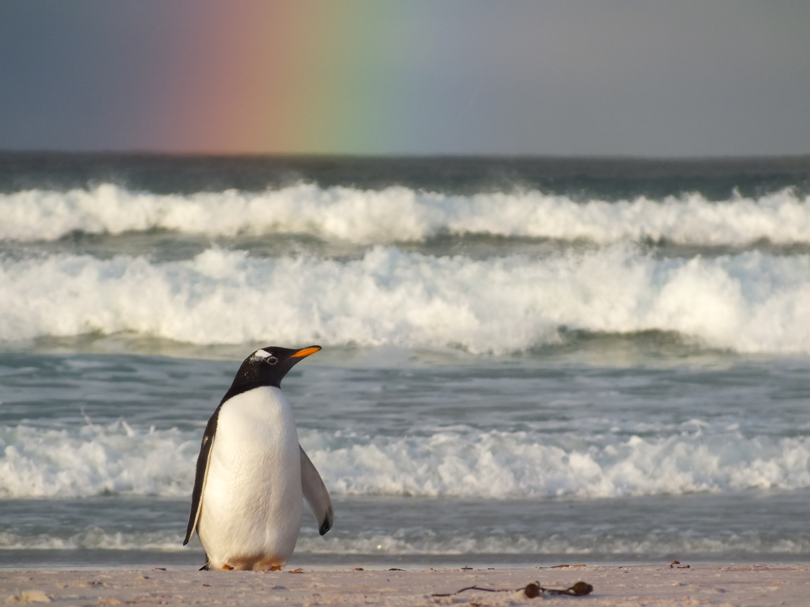

<!-- This is an HTML comment - it will not display when you build the book -->
<!-- Remember, inside this RMarkdown document, text that is not written in code chunks is written in html language -->
<!-- If you need PDF output, uncomment bookdown::pdf_book above in YAML. You will need a LaTeX installation, e.g., https://yihui.name/tinytex/ -->

<!-- Depending on the default setting in the YAML header of RMarkdown doc,
you can remove numbering from headers by adding {-} at the end of a header-->
# Preface {-}

<!--  -->
 

<!-- Adding   will give a single line break -->
 

